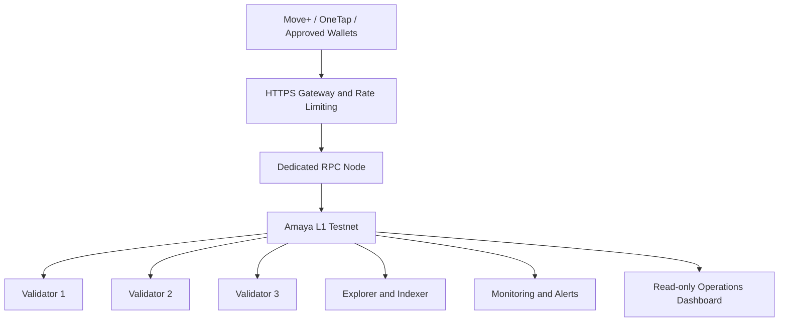
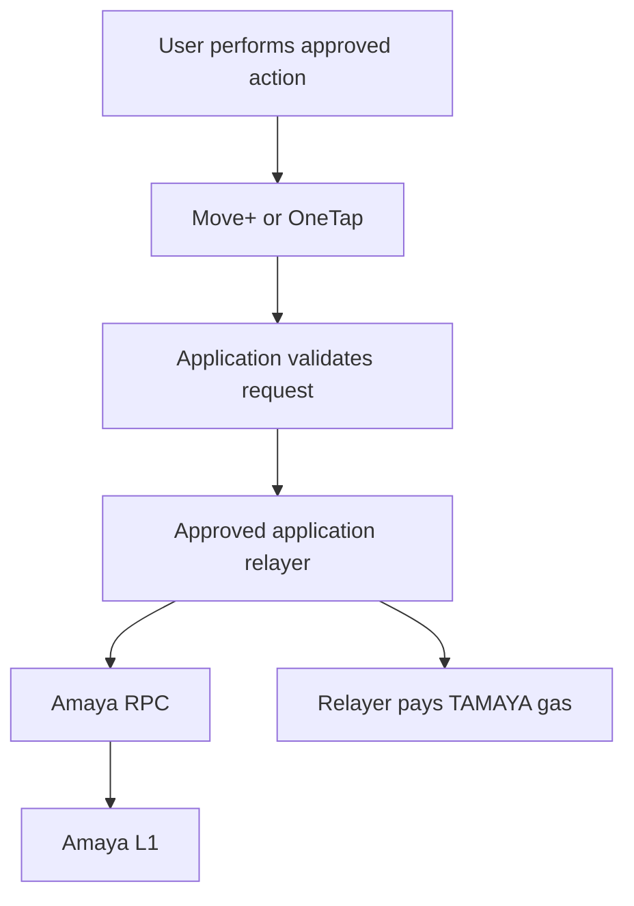

# Amaya L1

**Infrastructure for a Moving World.**

Amaya L1 is a Philippine-focused research and development initiative exploring a permissioned, EVM-compatible Avalanche Layer 1 network for practical consumer, mobility, marketplace, payment-settlement, and verification use cases.

> **Current status:** Documentation and Local Alpha preparation. Infrastructure foundation (runbooks, ADRs, preflight/validation) is in place; chain create/deploy remains approval-gated.
> No public mainnet, public token sale, government partnership, remittance partnership, lending partnership, or production payment service is represented by this repository.

---

## Why Amaya L1

Amaya L1 is being studied as shared infrastructure for approved applications that may benefit from:

- configurable low-cost transaction fees
- permissioned validators
- controlled smart-contract deployment
- gas-sponsored user experiences
- verifiable settlement and reconciliation
- tamper-evident records and audit trails
- dedicated capacity for Amaya applications
- application-specific network policies
- controlled institutional onboarding

Amaya L1 is not intended to replace application databases, regulated financial institutions, government systems, or private customer-data storage.

Its proposed role is to provide an additional settlement and verification layer for approved applications.

---

## Initial Ecosystem Scope

### Core Infrastructure

- **Amaya L1** — planned permissioned Avalanche L1
- **Amaya Local Alpha** — first one-validator local Proof of Concept
- **Amaya Testnet** — planned educational and public testing environment
- **TAMAYA** — valueless native test asset used only for testing and gas
- **Validator infrastructure**
- **Dedicated RPC infrastructure**
- **Amaya Explorer and indexer**
- **Network monitoring and alerts**
- **Read-only operations dashboard**
- **Application relayers**
- **Amaya Wallet Testnet** — possible future non-custodial test wallet
- **TAMAYA faucet** — planned only for a later public-testnet phase

### Primary Applications

#### Move+

Move+ is a gamified fitness ecosystem supporting:

- walking
- running
- cycling
- activity rewards
- digital gear
- challenges and achievements
- creator features
- optional Web3 integrations

Possible Amaya integrations include:

- wallet ownership verification
- sponsored test transactions
- digital-gear ownership
- marketplace settlement proofs
- reward-batch commitments
- challenge-completion proofs

Raw GPS routes, health information, personal profiles, messages, delivery information, and private anti-cheat records remain off-chain.

#### Move+ Marketplace

Move+ Marketplace supports real-item and digital-utility commerce.

Possible Amaya integrations include:

- merchant settlement proofs
- payment-confirmation proofs
- reward distribution
- buyer and seller transaction commitments
- approved marketplace smart contracts

Customer names, addresses, payment credentials, courier information, and private order details remain off-chain.

#### OneTap

OneTap is a transport and parking payment prototype designed around:

- tap-card transactions
- fast local processing
- offline-safe operation
- operator shift management
- merchant top-ups
- backend reconciliation
- settlement batching

OneTap is planned as the first infrastructure-focused Amaya L1 Proof of Concept.

The initial model does not place every passenger tap directly on-chain.

```text
Passenger tap
→ Local device processing
→ Offline-safe queue
→ Backend synchronization
→ Reconciliation
→ Settlement batch
→ Amaya proof
→ Dashboard verification
```

---

## Potential External Integrations

Amaya L1 may later support verified external organizations such as:

- payment providers
- remittance companies
- lending and financing companies
- transport operators
- parking operators
- cooperatives
- enterprises
- universities
- approved institutional systems
- government-authorized technology systems

These are potential integrations and are not Amaya-owned financial services.

External organizations remain responsible for:

- applicable licences
- customer funds
- customer verification
- lending decisions
- remittance operations
- consumer protection
- private customer information
- legal and regulatory compliance

Testnet access does not authorize an applicant to conduct regulated activity.

---

## Development Principles

1. **Products first, network second.**
2. **Testnet before mainnet.**
3. **No real funds on experimental infrastructure.**
4. **Private and sensitive data remain off-chain.**
5. **Validators, RPC, treasury, governance, and application keys remain separated.**
6. **No unverified partnership, adoption, or regulatory claims.**
7. **Security, monitoring, and recoverability are core features.**
8. **Existing Move+, OneTap, and multichain systems must not be modified without reviewed migration plans.**
9. **Users should not be forced to understand or manually acquire blockchain gas.**
10. **Mainnet proceeds only after technical need, security, and sustainability are proven.**

---

## Planned Technical Path

```mermaid
flowchart LR
    A["Documentation"] --> B["Local 1-validator PoC"]
    B --> C["Wallet connection"]
    C --> D["TAMAYA transfer"]
    D --> E["OneTap settlement demo"]
    E --> F["Move+ integration"]
    F --> G["Persistent Fuji validator"]
    G --> H["3-validator testnet"]
    H --> I["Dedicated RPC and explorer"]
    I --> J["Security and recovery testing"]
    J --> K["Public testnet"]
    K --> L["Mainnet readiness review"]
```



---

## Local Alpha

The first working milestone is intentionally small: **one sovereign Amaya L1 validator**.

**TAMAYA is a valueless testnet asset used only for gas and network testing.**

```text
Amaya L1 validators: 1 (sovereign)
Supporting Primary Network nodes: CLI-managed (not Amaya L1 validators)
Amaya L1 RPC: Discovered from deployment output (localhost; dynamic port)
Wallets: Test-only wallets
Native asset: TAMAYA (no monetary value)
Bridges: Disabled
Public access: Disabled
Real money: None
Production data: None
```

Avalanche CLI may also start supporting **Primary Network** nodes (commonly on ports such as 9650/9652). Those nodes are part of the local harness and are **not** additional Amaya L1 validators. The Amaya L1 RPC often uses a **dynamically assigned localhost port**—never hard-code **9650** as the Amaya L1 RPC. Keep Local Alpha bound to **localhost** only (do not expose via `0.0.0.0`). Port layout may change between Avalanche CLI versions.

### Architecture sequence

```text
1. Local Alpha
   └── 1 Amaya L1 validator · CLI-managed Primary Network support nodes
       · Amaya L1 RPC discovered at deploy (localhost) · Core · TAMAYA tests

2. Persistent Fuji testnet
   └── 1 persistent self-hosted Amaya L1 validator · permissioned access · monitoring · backups

3. Public testnet expansion
   └── 3 Amaya L1 validators · dedicated RPC · explorer/indexer · alerts · controlled faucet
```

Environments stay isolated (`config/local-alpha`, `config/fuji`, `config/mainnet`). Local Alpha configuration must not be copied blindly into Fuji or mainnet paths.

### Local Alpha Success Criteria

- [ ] Repository preflight and validation pass (or documented warnings)
- [ ] One Amaya L1 validator starts successfully (**approval required** for create/deploy)
- [ ] Amaya L1 RPC URL is discovered from deployment output (not assumed as port 9650)
- [ ] The Amaya L1 RPC responds on localhost
- [ ] A wallet connects to the correct chain
- [ ] The expected TAMAYA allocation is visible
- [ ] A TAMAYA transfer confirms
- [ ] The transaction receipt can be retrieved
- [ ] The validator can stop and restart
- [ ] Chain state remains available after restart
- [ ] No validator or wallet secrets are committed
- [ ] Deployment evidence is recorded (public identifiers only)
- [ ] Every verified command is documented

### Safe local preflight

These commands are **read-only**. They install nothing, start no services, and do not create or deploy a blockchain.

```bash
# From the repository root
make preflight    # or: bash scripts/preflight.sh
make validate     # or: bash scripts/validate-repository.sh
make status       # Git status + Avalanche CLI version (non-secret)
```

See [docs/operations/local-alpha-runbook.md](docs/operations/local-alpha-runbook.md). Creation and deployment remain **approval required**.

---

## Planned Testnet Architecture



The planned three-validator testnet should include:

- isolated validator environments
- dedicated HTTPS RPC
- rate limiting
- explorer and indexer
- monitoring and alerts
- wallet connection
- TAMAYA transfers
- verified test contracts
- OneTap settlement demonstration
- Move+ sponsored-transaction demonstration
- validator restart and recovery testing

---

## Validators and RPC

### Validators

Amaya L1 validators are responsible for:

- checking transactions
- participating in consensus
- verifying blocks
- maintaining synchronized network state
- verifying smart-contract execution

Local Alpha uses **one** Amaya L1 validator. CLI-managed Primary Network nodes that may appear locally are **not** Amaya L1 validators.

Validators do not decide whether:

- a Move+ activity is genuine
- a OneTap fare is correct
- a payment provider completed customer verification
- a lender should approve a borrower
- an institution should authorize a record

Those decisions remain with the authorized application or institution.

### RPC

RPC infrastructure allows wallets and applications to:

- read balances
- read blocks
- retrieve transaction receipts
- estimate gas
- call smart contracts
- submit signed transactions

RPC provides access to the network but does not decide consensus.

For Local Alpha, the Amaya L1 RPC URL must be **discovered from successful deployment output**. Do not assume port 9650 is the Amaya L1 RPC. Keep Local Alpha RPC on localhost only.

Public application traffic should eventually use dedicated RPC infrastructure rather than validator administration endpoints.

---

## TAMAYA

**TAMAYA is a valueless testnet asset used only for gas and network testing.**

```text
Asset name: Test Amaya
Symbol: TAMAYA
Network: Amaya L1 Testnet / Local Alpha
Value: None
Purpose: Development, testing, and gas only
```

TAMAYA is not:

- an investment
- a production token
- intended for public sale, presale, or exchange listing
- company equity
- a guarantee of receiving any future AMAYA asset

Testnet balances may be reset, replaced, or deleted.

Any future production AMAYA design requires separate technical, economic, security, and legal review.

---

## Sponsored Transactions

Move+ and OneTap users should not need to acquire TAMAYA manually for approved application actions.



Application relayers should use:

- dedicated wallets
- limited balances
- approved contract methods
- transaction limits
- rate limits
- replay protection
- monitoring
- emergency-disable controls

Move+ and OneTap must use separate relayer wallets.

---

## Data and Privacy

### Suitable for On-Chain Records

- wallet addresses
- transaction proofs
- settlement-batch identifiers
- cryptographic hashes
- document-version references
- timestamps
- status records
- smart-contract events
- correction or superseding references

### Must Remain Off-Chain

- names and home addresses
- raw GPS routes
- health information
- passenger travel histories
- bank-account details
- government identification information
- complete confidential documents
- passwords
- seed phrases
- private keys
- application credentials
- private anti-fraud logic

A cryptographic hash can verify whether a record changed, but it cannot reconstruct a missing document.

Complete records require secure storage, version history, backups, access controls, and recovery procedures.

---

## Security Model

The primary security principle is:

> One compromised device, server, account, application, or private key must not control the entire Amaya network.

Critical roles should remain separated:

- validator / node identity
- network deployer / admin
- treasury
- Move+ sponsored-gas relayer
- OneTap sponsored-gas relayer
- monitoring
- cloud infrastructure access

A development wallet must never become the future production treasury or validator identity. Move+ and OneTap must use separate relayer wallets.

Never commit or publish:

```text
Seed phrases
Private keys
Validator signing files
Wallet keystores
Production environment variables
SSH private keys
Cloud credentials
Treasury credentials
Internal institutional records
```

Local Alpha must remain localhost-only. Do not hard-code port 9650 as the Amaya L1 RPC.

See [SECURITY.md](SECURITY.md) and [docs/operations/key-separation.md](docs/operations/key-separation.md).

---

## Government and Institutional Research

A future synthetic demonstration may explore:

- government supplier and contractor payment proofs
- document authenticity
- document-version history
- milestone and inspection records
- payment-confirmation proofs
- institutional audit trails

Amaya L1 would not initially hold or release government money.

Existing banking, treasury, accounting, and procurement systems would remain responsible for official financial operations.

Any demonstration must use synthetic data and clearly state:

> Prototype using synthetic data. No government affiliation, official record, real contractor, or public payment is represented.

---

## Documentation

### Project Documentation

- [Vision](docs/01-vision.md)
- [Architecture](docs/02-architecture.md)
- [Roadmap](docs/03-roadmap.md)
- [Local Testnet](docs/04-local-testnet.md)
- [Validator and RPC](docs/05-validator-and-rpc.md)
- [Wallet and TAMAYA](docs/06-wallet-and-tamaya.md)
- [Security Model](docs/07-security-model.md)
- [OneTap Integration](docs/08-onetap-integration.md)
- [Move+ Integration](docs/09-moveplus-integration.md)
- [Government Pilot Concept](docs/10-government-pilot.md)
- [Glossary](docs/11-glossary.md)
- [Application and Partner Onboarding](docs/12-application-and-partner-onboarding.md)

### Infrastructure Foundation

- [Architecture overview](docs/architecture/overview.md)
- [ADRs](docs/decisions/)
- [Local Alpha runbook](docs/operations/local-alpha-runbook.md)
- [Key separation](docs/operations/key-separation.md)
- [Deployment records](docs/operations/deployment-records.md)
- [Move+ integration notes](docs/integrations/move-plus.md)
- [OneTap integration notes](docs/integrations/onetap.md)

### Technical Paper

- [Amaya L1 Technical Paper — Draft v0.1](docs/whitepaper/amaya-l1-technical-paper-v0.1.md)

### Repository Policies

- [Security Policy](SECURITY.md)
- [Legal and Project Status](LEGAL.md)
- [Contribution Guide](CONTRIBUTING.md)

---

## Repository Structure

```text
amaya-l1/
├── .cursor/rules/                 # Repository agent rules
├── .github/ISSUE_TEMPLATE
├── config/
│   ├── example                    # Public example placeholder
│   ├── local-alpha/               # Local Alpha declarative spec
│   ├── fuji/
│   └── mainnet/
├── contracts/TAMAYA
├── deployments/                   # Non-secret deployment evidence
│   ├── local-alpha/
│   ├── fuji/
│   └── mainnet/
├── docs/
│   ├── 01-vision.md … 12-…        # Public project documentation
│   ├── architecture/              # Infrastructure overview
│   ├── decisions/                 # ADRs
│   ├── integrations/
│   ├── operations/                # Runbooks and ops
│   └── whitepaper/
├── scripts/
│   ├── preflight.sh               # Read-only operator preflight
│   ├── validate-repository.sh     # Read-only repo validator
│   └── sample
├── CONTRIBUTING.md
├── LEGAL.md
├── Makefile
├── README.md
├── SECURITY.md
└── .env.example                   # Non-secret placeholders only
```

---

## Contributing

Amaya L1 is currently founder-led and in early Proof-of-Concept development.

Contributions may include:

- documentation corrections
- security observations
- architecture feedback
- reproducibility improvements
- test coverage
- safe development tooling

Do not submit:

- private keys
- seed phrases
- live credentials
- copied proprietary code
- production institutional data
- unverified partnership claims
- token-sale or investment promotions

Read [CONTRIBUTING.md](CONTRIBUTING.md) before submitting a pull request.

---

## Responsible Security Reporting

Do not publicly disclose an exploitable vulnerability through a GitHub issue.

Follow the private reporting instructions in [SECURITY.md](SECURITY.md).

Reports should include:

- affected component
- reproduction steps
- potential impact
- proposed mitigation when available
- confirmation that no real user funds or data were accessed

---

## Current Status

Amaya L1 currently has:

- public project documentation
- validator and RPC architecture
- security model
- OneTap integration design
- Move+ integration design
- partner-onboarding framework
- technical paper draft
- Local Alpha preparation

Amaya L1 does not currently have:

- an operational public testnet
- a public production RPC
- a production explorer
- a production AMAYA asset
- a public token sale
- an official Amaya Wallet
- live OneTap settlement
- live Move+ settlement
- government deployment
- remittance deployment
- lending deployment
- a public bridge
- mainnet

---

## Disclaimer

This repository contains research, planning documents, technical designs, and experimental software.

Nothing in this repository constitutes:

- financial advice
- investment advice
- an offer to sell tokens or securities
- a promise of future value
- a government partnership
- an Avalanche Foundation partnership
- a licensed financial service
- a production-readiness guarantee

**TAMAYA is a valueless testnet asset used only for gas and network testing.**

Explicit non-goals for early phases include: public token-launch platforms, unrestricted third-party fungible tokens, early bridges, Project Agilus, and real government affiliation, records, or funds (government-themed work is synthetic research/demo only).

---

## Working Principle

> **Small team. Clear responsibilities. AI-accelerated development. Human-reviewed security. Product first. Network second. Mainnet only after proof.**
