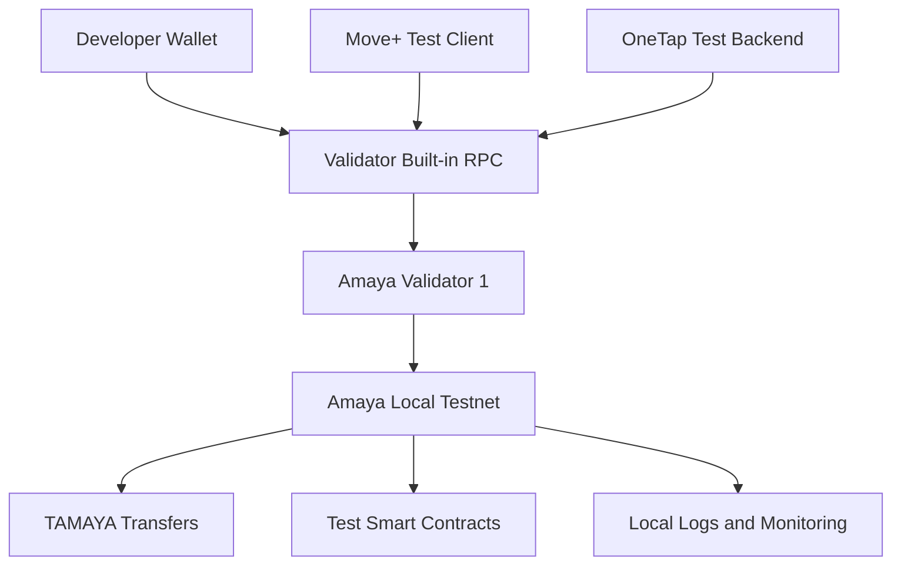
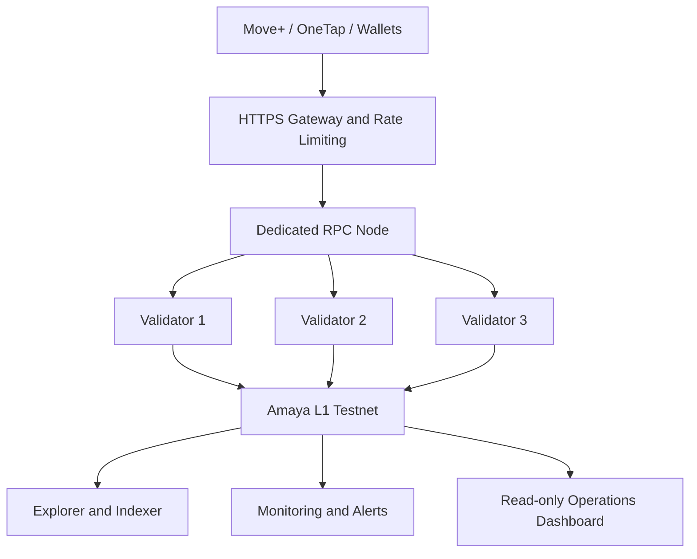
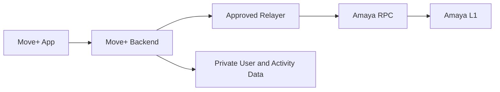
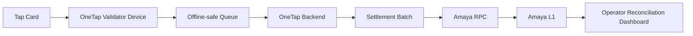

# Amaya L1 — Architecture

## Overview

Amaya L1 is planned as an EVM-compatible, permissioned Avalanche Layer 1 network.

The initial architecture will begin with one local validator for education and proof-of-concept testing. It may later progress to three validators on Fuji Testnet and a larger validator set only when production readiness is established.

## Architecture Principles

The architecture follows these principles:

- validators are separated from public application traffic
- RPC nodes provide application and wallet access
- application backends retain private business data
- only necessary settlement records and proofs are written on-chain
- administration, deployment, treasury, and relayer keys are separated
- critical systems are designed for monitoring and recovery
- no single public dashboard can control the network

## Local Proof-of-Concept Architecture



During the first local proof of concept:

- one machine may operate the validator
- the validator RPC may be used temporarily
- no public infrastructure or real assets are involved

## Planned Fuji Testnet Architecture



A second RPC node and load balancer may be added when traffic and reliability requirements justify them.

## Main Components

### Validators

Validators:

* check transactions
* participate in network consensus
* maintain synchronized copies of the chain
* confirm blocks and network state
* help prevent one application server from controlling the official record

Validators should not serve unrestricted public application traffic in a mature deployment.

### RPC Nodes

RPC nodes act as the communication gateway between Amaya L1 and:

* wallets
* Move+
* OneTap
* smart-contract tools
* explorers
* approved application backends

RPC nodes:

* read blockchain information
* accept signed transactions
* broadcast transactions to the network
* return transaction receipts and status
* provide gas estimates and contract-call results

RPC nodes do not replace validators and do not decide consensus.

### Explorer and Indexer

The explorer and indexer organize blockchain data so users and developers can view:

* blocks
* transactions
* wallet addresses
* smart-contract activity
* network statistics
* test asset transfers

Explorer availability does not determine whether consensus is operating.

### Monitoring

Monitoring should track:

* validator availability
* current block height
* synchronization status
* peer count
* CPU and memory usage
* storage usage
* RPC latency
* RPC error rate
* software versions
* unexpected restarts
* validator fee balance where applicable

The first monitoring implementation may use existing Avalanche-compatible monitoring tools before a custom Amaya operations dashboard is developed.

## Application Architecture

### Move+



Private Move+ data remains in the application backend.

Amaya L1 may receive only approved records such as:

* settlement proofs
* reward-batch references
* asset ownership
* marketplace-payment proofs
* approved achievement records

### OneTap



Individual taps do not need to be submitted directly on-chain in real time.

The first design will group completed transactions into settlement batches, preserving OneTap's speed and offline capability.

## Data Boundaries

### Suitable for On-Chain Records

* wallet addresses
* asset ownership
* transaction proofs
* settlement-batch identifiers
* cryptographic hashes
* document-version references
* approval-status records
* timestamps
* smart-contract events

### Remains Off-Chain

* names and home addresses
* health and fitness information
* raw GPS routes
* complete passenger travel histories
* government identification data
* bank-account information
* complete confidential documents
* application passwords and credentials
* private signing keys

## Key Separation

The following roles must remain separate:

```text
Validator identity keys
Validator management wallet
Contract deployer wallet
Test treasury wallet
Application relayer wallet
Normal user wallet
Future production treasury multisig
```

Compromise of an application relayer must not provide control over validators, governance, or treasury assets.

## Access Model

The planned early access model is:

* approved validators
* approved contract deployers
* approved application relayers
* public or limited read access
* controlled transaction submission where required

The final production access model remains subject to testnet results, security review, legal requirements, and partner needs.

````


