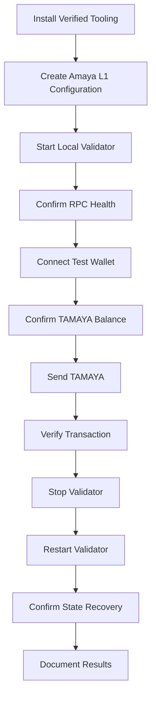

# Amaya L1 — Local Testnet Guide

## Status

This document defines the goals and safety requirements for Amaya Local Alpha.

Exact installation commands will be added only after they are tested against current official Avalanche tooling and verified on the target development machine.

## Purpose

The local testnet allows Amaya L1 to be created and tested without:

- public infrastructure
- cloud-validator costs
- real AVAX
- real AMAYA
- external users
- production data
- production application changes

It is the first technical Proof of Concept for Amaya L1.

## Initial Environment

The first local test is planned for:

```text
Development machine: Apple Silicon Mac
Memory: 16 GB
Network type: Local development network
Validators: 1
RPC: Validator's local RPC
Native test asset: TAMAYA
Public access: Disabled
Real monetary value: None


## Planned Flow



## Required Wallet Roles

Use separate test accounts for:

* network administration
* contract deployment
* test treasury
* application relayer
* normal test user

These accounts are for local testing only.

## Safety Rules

### Test Keys Only

* Never reuse local keys on Fuji Testnet.
* Never reuse local keys on mainnet.
* Never import a wallet holding valuable assets.
* Never publish seed phrases or private keys.
* Never store private keys in repository files.

### No Real Assets

Do not send or bridge:

* real AVAX
* real AMAYA
* stablecoins
* production NFTs
* customer funds
* application treasury assets

The local network may be reset or deleted at any time.

### Repository Safety

Never commit:

```text
.env
Private keys
Seed phrases
Wallet keystores
staker.key
staker.crt
signer.key
SSH private keys
Cloud credentials
Local blockchain databases
```

### Development-Machine Safety

Before starting:

* confirm available storage
* close unnecessary applications
* confirm the machine is connected to power
* back up unrelated development projects
* record installed tool versions
* do not run commands that have not been reviewed
* do not expose local RPC ports publicly

## Storage

A temporary local development network normally starts smaller than a long-running persistent validator, but blockchain data and logs will grow during testing.

Before deployment:

* record available disk space
* monitor storage growth
* remove abandoned local networks only after confirming their paths
* back up documentation before deleting test data
* never delete directories through an unreviewed command

Persistent Fuji or mainnet validators will use dedicated infrastructure rather than the primary development computer.

## RPC Access

During Local Alpha:

* use a local-only RPC endpoint
* do not expose it through the router
* do not add a public DNS record
* do not enable unnecessary administration APIs
* do not use it as a production application endpoint

A dedicated public RPC node will be introduced only during a later testnet phase.

## Logging

Record:

* operating-system version
* machine architecture
* Avalanche CLI version
* AvalancheGo version
* virtual-machine version
* time the validator started
* time the validator stopped
* RPC health result
* TAMAYA transfer transaction identifier
* errors and resolutions
* storage usage before and after testing

Logs must be reviewed for secrets before being published.

## Success Criteria

Amaya Local Alpha is complete only when:

* [ ] The local validator starts successfully.
* [ ] The RPC responds.
* [ ] A wallet connects.
* [ ] TAMAYA is visible.
* [ ] A TAMAYA transfer confirms.
* [ ] The transaction can be independently verified.
* [ ] The validator stops safely.
* [ ] The validator restarts successfully.
* [ ] Previous state remains available after restart.
* [ ] No secrets are committed.
* [ ] The complete process is documented.
* [ ] Another clean environment can reproduce the result.

## Failure Conditions

The test is not considered complete when:

* undocumented manual fixes are still required
* the wallet connects only intermittently
* keys or credentials are stored insecurely
* the validator cannot recover after restart
* the process cannot be reproduced
* the setup depends on production application secrets
* public network ports were unintentionally exposed

## Expected Outputs

The first local test should produce:

```text
Test environment summary
Installed version record
Amaya network configuration summary
Wallet network settings
TAMAYA transfer proof
Validator start and stop procedure
Recovery-test result
Known issues
Troubleshooting notes
Updated changelog
```

## Next Stage

After Local Alpha succeeds repeatedly:

```text
Local one-validator network
        ↓
OneTap settlement proof
        ↓
Move+ test integration
        ↓
One-validator Fuji Testnet
        ↓
Three-validator public testnet
```

No Fuji or mainnet deployment should begin until the local procedure is stable and reproducible.

```

Avalanche’s official local workflow uses Avalanche CLI to create an L1 configuration and deploy it to a local network. Hardware needs depend on throughput and state growth; persistent L1 validators have higher storage and uptime expectations than a temporary local proof of concept. :contentReference[oaicite:1]{index=1}
```

