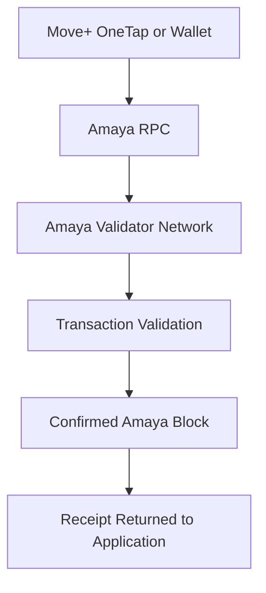
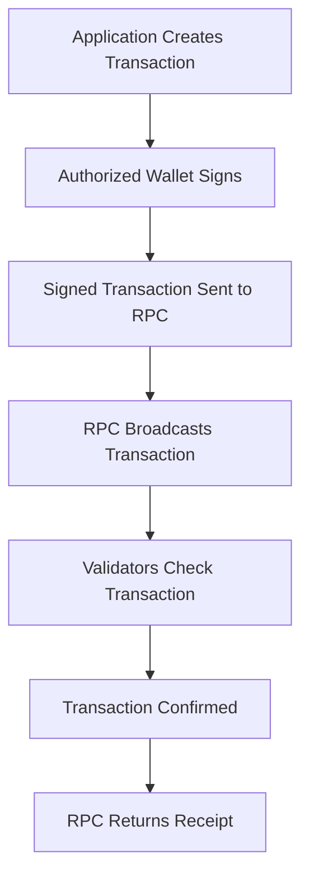
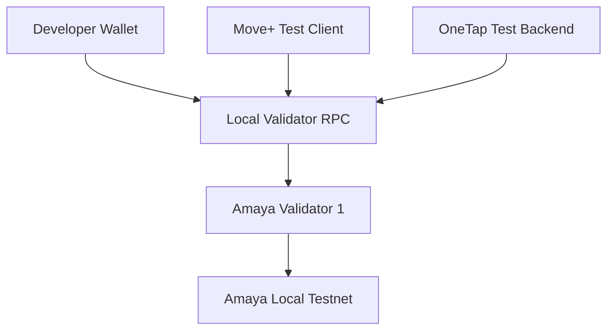
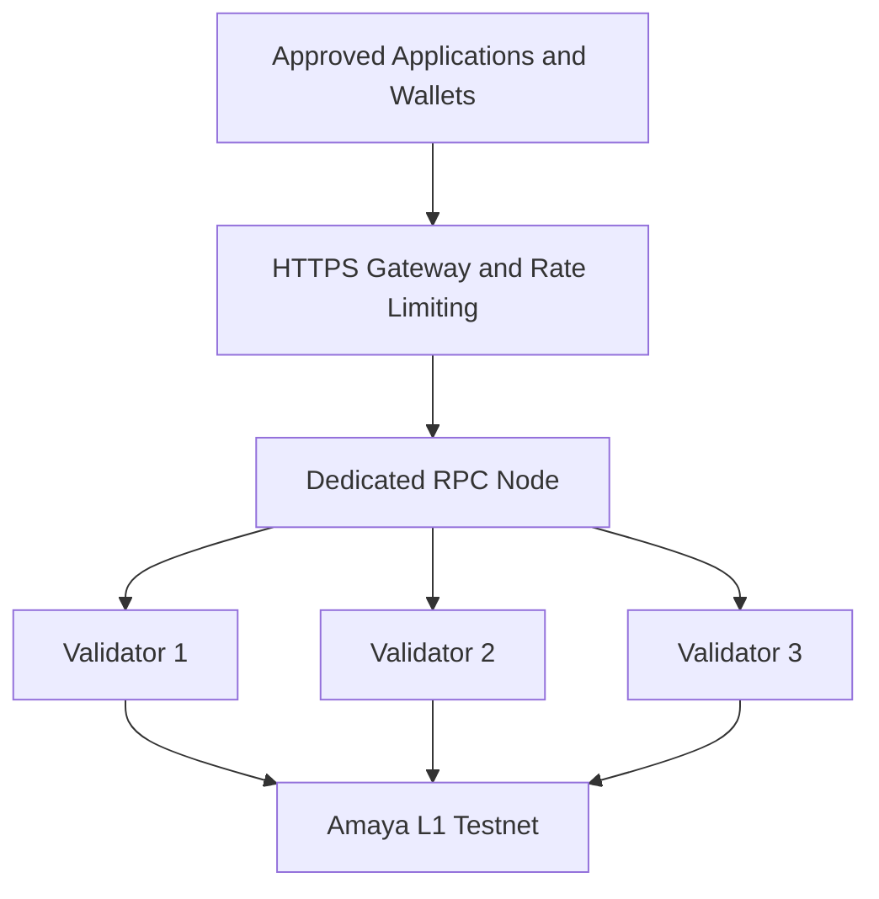
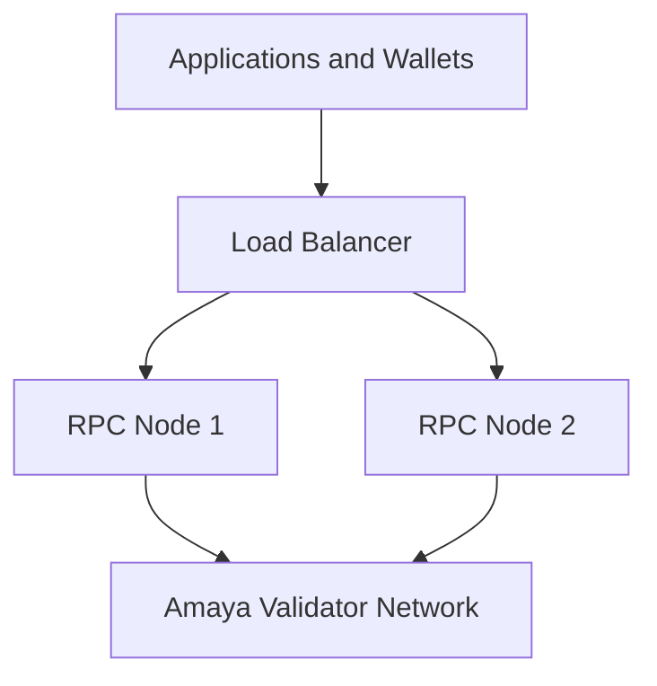

# Amaya L1 — Validator and RPC Infrastructure

## Overview

Validators and RPC nodes perform different but complementary roles within Amaya L1.

- **Validators** participate in consensus and maintain the official network state.
- **RPC nodes** provide the connection used by wallets, applications, explorers, and approved services.

The first Amaya Local Alpha may temporarily use one validator's built-in RPC endpoint. A dedicated RPC node will be introduced before the testnet is opened to external users.

## Validator Role

An Amaya L1 validator is a secured node that:

- checks transactions against network rules
- participates in consensus
- verifies proposed blocks
- maintains a synchronized copy of Amaya L1
- confirms the official state of accounts and contracts
- tracks the validator information required by Avalanche
- helps prevent one application database from controlling the only record

A validator does not automatically:

- control user wallets
- approve business decisions
- own user funds
- operate the Move+ or OneTap backend
- release government or contractor payments
- replace application-level fraud prevention

Business rules remain inside approved applications and smart contracts.

## Simple Transaction Flow



## What Validators Check

Depending on the transaction, validators may verify:

- the transaction format is valid
- the digital signature is valid
- the sender has enough native balance for gas
- the account nonce is correct
- the smart-contract call follows its programmed rules
- the transaction does not attempt an invalid state change
- the proposed block follows Amaya L1 consensus rules

Validators do not decide whether a contractor completed a project or whether a Move+ activity is genuine.

Those decisions must first be validated by the authorized application or institution. Validators confirm only the resulting properly authorized transaction.

## Initial Validator Stages

### Local Alpha

```text
Validators: 1
Location: Local development machine
Public access: Disabled
RPC: Validator built-in RPC
Assets: TAMAYA only
Purpose: Education and Proof of Concept
```

When the validator is turned off, the local network stops. This is acceptable during early development.

### Fuji Testnet Alpha

```text
Validators: 1
Location: Dedicated test environment
Public access: Limited
RPC: HTTPS endpoint
Assets: TAMAYA only
Purpose: Persistent external testing
```

This stage proves that wallets and approved applications can connect from external devices.

### Public Testnet

```text
Validators: 3
RPC nodes: At least 1 dedicated node
Explorer: Enabled
Monitoring: Enabled
Public documentation: Enabled
Assets: TAMAYA only
```

The three validators should eventually use separate machines or isolated environments.

### Mainnet Readiness Target

A possible production target may include:

```text
Validators: 5 or more
RPC nodes: 2 or more
Load balancer: Required
Monitoring: Required
Multisig governance: Required
Independent security review: Required
```

This is a planning target, not a commitment to launch.

## Validator Isolation

Multiple validators should not depend on one shared point of failure.

Avoid placing every production validator under:

- one physical computer
- one cloud account
- one internet connection
- one administrator password
- one data centre
- one copied validator identity
- one power source
- one recovery email or authentication method

During Local Alpha, one machine is acceptable because no real assets or external users are involved.

## Validator Identity

Each validator has sensitive identity and signing material.

Examples may include:

```text
staker.key
staker.crt
signer.key
```

These files must never be:

- committed to GitHub
- shared through email or messaging applications
- stored in public cloud folders
- copied into public server images
- reused between testnet and mainnet
- exposed through an RPC endpoint
- included in logs or screenshots

Encrypted offline backups should be maintained separately from the active validator.

## Duplicate Validator Identity

The same validator identity must not be active on two machines simultaneously.

A replacement validator should be started only through a documented recovery or migration procedure.

Running duplicate identities may create operational and security problems.

## RPC Role

RPC stands for Remote Procedure Call.

The RPC node is the network gateway used by:

- Move+
- Move+ Marketplace
- OneTap
- supported wallets
- smart-contract development tools
- explorers and indexers
- application relayers
- approved integration services

An RPC endpoint can answer requests such as:

```text
What is this wallet's TAMAYA balance?
What is the current block height?
Was this transaction confirmed?
What data is stored in this contract?
How much gas may this transaction require?
Submit this signed transaction.
```

## Read and Write Requests

### Read Requests

Read requests may retrieve:

- wallet balances
- block information
- transaction receipts
- smart-contract state
- token or NFT ownership
- gas estimates
- network and chain information

Read requests normally do not change blockchain state and do not consume TAMAYA gas.

### Transaction Requests

A state-changing transaction follows this flow:



The RPC does not replace the wallet signature and does not independently make an invalid transaction valid.

## Local RPC Architecture

During Amaya Local Alpha:



Rules for Local Alpha:

- bind the RPC to the local development environment
- do not expose it through the public router
- do not publish a DNS record
- do not enable unnecessary APIs
- do not use it for production applications
- do not store wallet private keys on the validator

## Public Testnet RPC Architecture



A dedicated RPC protects validators from direct public application traffic.

## Planned RPC Domains

Possible testnet endpoints include:

```text
rpc-testnet.amayal1.com
status.amayal1.com
explorer-testnet.amayal1.com
```

These addresses will not be activated until the corresponding infrastructure is deployed and secured.

## Public RPC Security

A public RPC endpoint should include:

- HTTPS encryption
- valid TLS certificates
- request rate limiting
- request-size limits
- connection limits
- firewall restrictions
- denial-of-service protection
- health monitoring
- latency monitoring
- error-rate monitoring
- log rotation
- protected internal administration access

Public RPC services must not expose:

- validator keys
- server credentials
- wallet private keys
- administrative RPC methods
- debugging interfaces containing sensitive data
- internal monitoring systems
- unrestricted operating-system access

## Administrative APIs

Administrative and debugging APIs must remain disabled or privately restricted unless they are specifically required for controlled maintenance.

They must never be exposed through the ordinary public Amaya RPC endpoint.

## RPC Failure

An RPC outage and a validator-network outage are different.

```text
RPC offline
→ Validators may continue producing blocks
→ Users and applications may temporarily lose access

Validators offline beyond consensus requirements
→ The chain may stop confirming transactions
```

This distinction should be reflected in monitoring and incident reports.

## Future RPC Redundancy

A mature deployment may use:



If one RPC node becomes unavailable, traffic can be routed to the remaining healthy node.

## Monitoring Requirements

Validator monitoring should track:

- node online or offline status
- synchronization status
- current block height
- peer count
- CPU usage
- memory usage
- disk usage
- disk errors
- network traffic
- unexpected restarts
- AvalancheGo version
- validator registration status
- validator fee balance where applicable

RPC monitoring should track:

- endpoint availability
- response latency
- request volume
- failed requests
- rate-limit events
- connection count
- upstream node health
- abnormal traffic patterns
- TLS certificate expiration

## Operations Dashboard

The first operations dashboard should be read-only.

It may display:

```text
Validator status
RPC status
Block height
Synchronization status
Peer count
CPU and memory
Storage usage
Software version
Recent incidents
TAMAYA relayer balance
```

It must not contain public buttons for:

- exporting keys
- transferring treasury assets
- removing validators
- changing network ownership
- deploying contracts
- changing critical network configuration
- restarting all validators simultaneously

## Software Updates

Validator updates should be tested and deployed gradually.

```text
Local environment
→ Fuji test validator
→ First production validator
→ Observation period
→ Remaining validators one at a time
```

Every update should include:

- version information
- official source verification
- configuration backup
- rollback plan
- maintenance notice where required
- post-update health checks

## Backup and Recovery

Recovery documentation should cover:

- validator identity backup
- configuration backup
- database recovery strategy
- clean server replacement
- credential rotation
- compromised-validator removal
- re-synchronization
- post-recovery verification

Recovery procedures should be tested on testnet before mainnet readiness is considered.

## Initial Success Criteria

The validator and RPC milestone is complete when:

- [ ] One local validator starts successfully.
- [ ] The local RPC responds.
- [ ] The RPC is not publicly exposed.
- [ ] A wallet can read the network.
- [ ] A signed TAMAYA transfer can be submitted.
- [ ] Validators confirm the transaction.
- [ ] The transaction receipt can be retrieved.
- [ ] The validator can stop and restart.
- [ ] Chain state remains available after restart.
- [ ] No validator or wallet secrets are committed.
- [ ] The complete procedure is documented.

## Current Status

Validator and RPC infrastructure is currently in documentation and local Proof-of-Concept preparation.

No public Amaya RPC or production validator network is represented by this repository.
