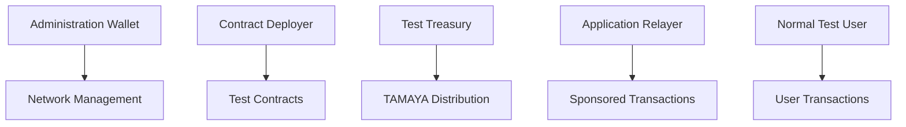
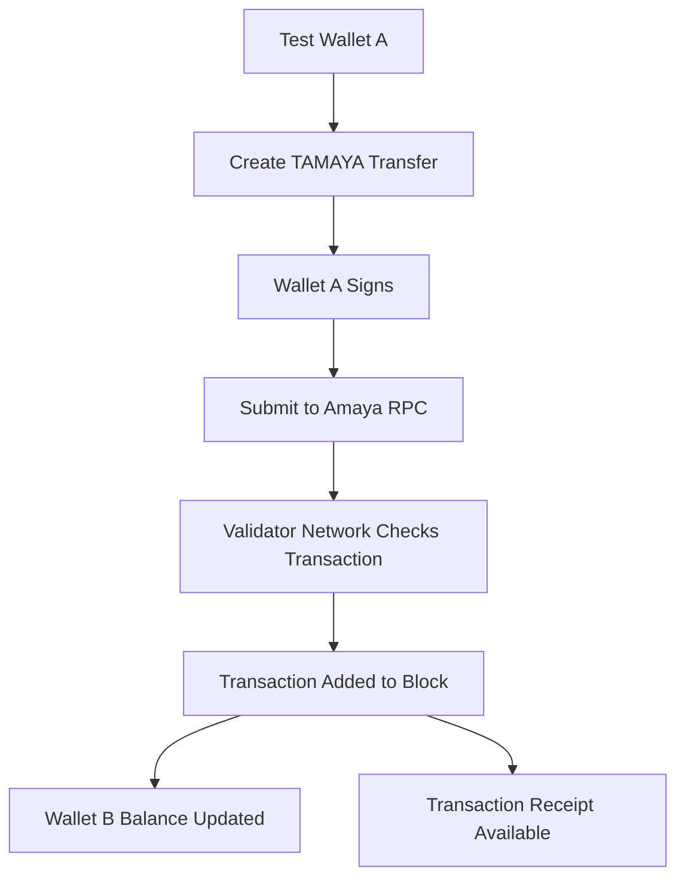
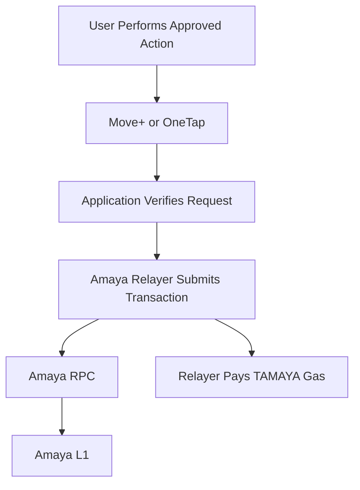

# Amaya L1 — Wallet and TAMAYA

## Overview

An EVM-compatible wallet is required to interact directly with Amaya L1.

During the first Proof of Concept, Amaya will use an existing supported wallet rather than immediately building a custom production wallet.

The initial wallet will be used to:

- connect to Amaya Local Alpha
- display TAMAYA
- send and receive TAMAYA
- sign test transactions
- interact with test smart contracts
- verify transaction history

## TAMAYA

TAMAYA is the native test asset of Amaya Testnet.

```text
Asset name: Test Amaya
Symbol: TAMAYA
Network: Amaya L1 Testnet
Value: None
Purpose: Testing only
```

TAMAYA is used for:

- test transaction gas
- wallet transfers
- smart-contract deployment
- smart-contract calls
- application-relayer testing
- Move+ integration testing
- OneTap settlement testing

## TAMAYA Is Not a Public Token

TAMAYA:

- has no monetary value
- is not intended for sale
- is not an investment
- is not intended for exchange listing
- does not represent equity
- does not promise a future AMAYA allocation
- must not be promoted as having future financial value

Testnet balances may be reset, replaced, or deleted.

## Native Asset Versus ERC-20

TAMAYA is planned as the native asset of Amaya Testnet.

It is not deployed as an ordinary ERC-20 smart contract.

```text
TAMAYA
→ Defined as part of Amaya Testnet
→ Used directly for network gas

Test ERC-20 assets
→ Deployed later through smart contracts
→ Used only when an application requires them
```

The initial TAMAYA allocation will be configured when the local network is created.

## TAMAYA and Future AMAYA

TAMAYA and any future production AMAYA asset must remain separate.

| Asset | Network | Value | Purpose |
|---|---|---:|---|
| TAMAYA | Amaya Testnet | None | Development and gas testing |
| AMAYA | Future production design | Not yet determined | Possible ecosystem and network utility |

Holding TAMAYA does not guarantee receiving future AMAYA.

No future AMAYA launch is guaranteed by this repository.

## Initial Wallet Choice

The first Amaya Local Alpha test is planned to use Core or another verified EVM-compatible wallet that supports custom network settings.

A custom Amaya Wallet may be developed later after the underlying network workflow is stable.

## Wallet Network Configuration

A wallet normally requires:

```text
Network name
RPC URL
EVM chain ID
Native currency name
Native currency symbol
Block explorer URL
```

An example development configuration may later resemble:

```text
Network name: Amaya Local Alpha
RPC URL: Local RPC endpoint
Chain ID: Assigned during network creation
Currency symbol: TAMAYA
Explorer URL: Not available during the first local test
```

The real values will be published only after the local network is created and verified.

## Planned Public Testnet Settings

When the public testnet is ready, the public configuration may include:

```text
Network name: Amaya L1 Testnet
RPC URL: https://rpc-testnet.amayal1.com
Chain ID: To be published
Currency symbol: TAMAYA
Explorer: https://explorer-testnet.amayal1.com
```

These endpoints are placeholders until formally deployed.

Users should never trust unofficial RPC or explorer addresses.

## Development Wallet Roles

Separate test wallet accounts should be used for separate responsibilities.

### Network Administration Wallet

Used for approved network-management procedures.

It should not be used for:

- ordinary testing
- application transactions
- marketplace payments
- daily browsing
- public demonstrations

### Contract Deployer Wallet

Used to deploy approved test smart contracts.

It should not control:

- validator management
- the test treasury
- application-user wallets

### Test Treasury Wallet

Holds the initial TAMAYA allocation used for:

- test funding
- faucet funding
- relayer funding
- controlled demonstrations

### Application Relayer Wallet

Used by approved applications to submit sponsored transactions.

Separate relayer wallets may later be used for:

- Move+
- OneTap
- marketplace settlement
- approved pilot applications

### Normal Test User Wallet

Used to simulate an ordinary user.

It should have no administrative privileges.

## Wallet Separation



One compromised wallet should not control every network function.

## Basic TAMAYA Transfer

The first transfer demonstration will follow this flow:



## First Transfer Success Criteria

The transfer is successful when:

- the sender address is correct
- the receiving address is correct
- the sender has enough TAMAYA
- the transaction is signed by the sender
- the RPC accepts the transaction
- validators confirm it
- the receiver balance increases
- the transaction receipt is available
- the transaction remains visible after validator restart

## Gas

TAMAYA is used to pay test gas inside Amaya Testnet.

The transaction cost depends on:

```text
Gas used
×
Gas price
=
TAMAYA transaction fee
```

The gas configuration will be tested to remain inexpensive while preserving protection against spam.

Gas should not be configured as completely free on a publicly accessible network without additional controls.

## Sponsored Gas

Move+ and OneTap users should not be required to understand or manually purchase gas during future application testing.

A sponsored transaction may work as follows:



The application may sponsor gas subject to:

- approved actions
- transaction limits
- rate limits
- relayer balance limits
- user authorization
- anti-abuse checks
- emergency pause controls

## TAMAYA Distribution

During Local Alpha, TAMAYA may be distributed manually from the test treasury.

During a future public testnet, a faucet may be introduced.

Possible faucet domain:

```text
faucet-testnet.amayal1.com
```

A public faucet should include:

- per-wallet limits
- time-based claim limits
- abuse prevention
- bot protection
- clear testnet disclaimers
- monitoring
- emergency disable controls

## Wallet Security Rules

Never:

- share a seed phrase
- paste a private key into a website
- commit keys to GitHub
- store keys in public cloud documents
- reuse testnet keys on mainnet
- import a wallet containing valuable assets
- expose wallet credentials through logs
- send real assets to Amaya Testnet
- trust unofficial RPC addresses
- approve an unknown smart contract

## Local Development Wallets

Local-development wallets must be treated as disposable test identities.

They should not be used for:

- real AVAX
- stablecoins
- production NFTs
- public AMAYA
- personal crypto holdings
- production contract administration

## Future Amaya Wallet

A future Amaya Wallet Testnet may provide:

- Amaya Testnet preconfigured
- TAMAYA balance
- send and receive
- transaction history
- QR address display
- explorer links
- approved application connections
- testnet warning banner
- non-custodial key management

## Non-Custodial Principle

The intended initial wallet direction is non-custodial.

This means:

- keys are generated or imported by the user
- keys remain under the user's control
- Amaya does not hold the user's private key
- transactions require user authorization
- the wallet does not allow Amaya to silently move user assets

Any recovery feature must be separately designed and reviewed to ensure that it does not unintentionally create custodial control.

## Not Included in the First Wallet Version

The first test wallet should not include:

- fiat balances
- cash-in or cash-out
- token sales
- swaps
- bridges
- yield products
- lending
- staking investments
- remittance
- custodial recovery
- real-money payment services

## Wallet Testing Checklist

- [ ] Wallet connects to the correct Amaya network.
- [ ] Chain ID matches the official configuration.
- [ ] RPC URL matches the official endpoint.
- [ ] TAMAYA is displayed as the native asset.
- [ ] Wallet A can send TAMAYA.
- [ ] Wallet B can receive TAMAYA.
- [ ] Transaction status is correctly displayed.
- [ ] Explorer link opens the correct transaction when available.
- [ ] Incorrect chain configuration is rejected or clearly detected.
- [ ] Test keys are not reused elsewhere.
- [ ] No sensitive information appears in logs.
- [ ] Transaction remains visible after validator restart.

## Application Wallet Experience

Developer testing may use a traditional browser wallet.

The future application experience may use:

```text
Move+ or OneTap account
        ↓
User-controlled wallet or smart account
        ↓
Application-sponsored transaction
        ↓
Amaya L1
```

Ordinary users should not be required to manually configure validators or understand blockchain infrastructure.

## Current Status

TAMAYA and Amaya wallet integration are currently in planning and documentation.

No official Amaya wallet, public faucet, production AMAYA asset, or public testnet RPC is currently represented by this repository.
