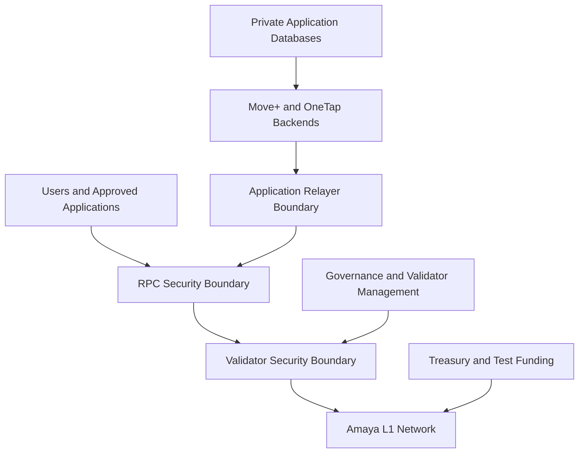
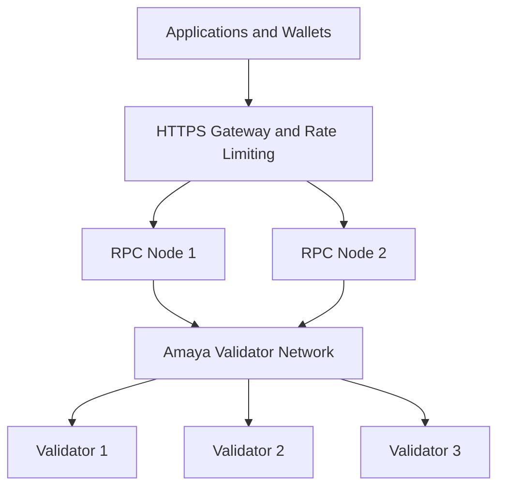

# Amaya L1 — Security Model

## Overview

Security is a core requirement of Amaya L1.

The network will be developed in stages, beginning with a local Proof of Concept that contains no valuable assets, followed by controlled testnet environments. Mainnet will be considered only after validator operations, key management, recovery procedures, monitoring, application integrations, and governance controls have been tested.

The primary security principle is:

> One compromised device, server, account, application, or private key must not provide control over the entire Amaya network.

## Current Security Status

Amaya L1 is currently in:

- architecture planning
- public documentation
- threat-model development
- local Proof-of-Concept preparation

Amaya L1 does not currently represent:

- an audited production network
- a public mainnet
- a production bridge
- a custodial wallet
- a production payment system
- infrastructure approved for valuable government or institutional records

## Security Objectives

Amaya L1 security aims to protect:

- validator availability
- network consensus
- validator-management authority
- wallet and treasury assets
- application relayers
- smart contracts
- RPC infrastructure
- testnet and mainnet separation
- private application data
- software and deployment integrity
- backup and recovery procedures

## Threat Model

The security design must consider threats including:

- stolen wallet or validator keys
- phishing and malware
- compromised development devices
- compromised cloud accounts
- unauthorized validator changes
- RPC flooding and denial-of-service attacks
- vulnerable smart contracts
- malicious or altered software packages
- insider misuse
- accidental configuration errors
- infrastructure outages
- lost backups
- supply-chain attacks
- bridge or interoperability exploits
- leaked application secrets
- unauthorized access to private user data

## Security Boundaries

Amaya L1 consists of multiple independent security boundaries.



Compromise of one boundary must not automatically provide control over the others.

## Separation of Critical Roles

The following roles should use separate wallets, keys, and permissions:

```text
Validator identity
Validator management
Contract deployment
Network governance
Test treasury
Production treasury
Move+ relayer
OneTap relayer
Normal application user
Monitoring operator
Cloud administrator
```

For example:

- A Move+ relayer must not add or remove validators.
- A validator server must not control the treasury.
- An RPC node must not store user private keys.
- A contract deployer must not automatically control validator governance.
- A monitoring account must not modify network configuration.

## Validator Security

Each validator must use an independent identity.

Sensitive validator files may include:

```text
staker.key
staker.crt
signer.key
```

These files must never be:

- committed to GitHub
- sent through email or messaging applications
- included in screenshots
- stored in public cloud folders
- included in public server images
- exposed through RPC
- reused between local testnet, Fuji, and mainnet
- copied to an untrusted device

## Validator Isolation

During local testing, one validator on one development machine is acceptable because the environment contains no valuable assets or public users.

A mature testnet or production environment should reduce shared failure points.

Avoid placing every validator under:

- one physical machine
- one server account
- one cloud-provider account
- one internet connection
- one electrical circuit
- one administrator password
- one recovery email
- one hardware device
- one data centre
- one copied validator identity

Several validators in one room may protect against one machine failure but not against:

- fire
- flooding
- theft
- overheating
- long power outages
- building-level internet failure
- physical intrusion

## Validator Server Controls

A validator server should use:

- a supported operating system
- a dedicated non-root service account
- SSH key authentication
- disabled password-based SSH
- disabled direct root login
- a default-deny firewall
- restricted administrative access
- security updates
- disk and service monitoring
- automatic service restart where safe
- protected configuration files
- encrypted backups
- audit logs

Only required network ports should be exposed.

Public application traffic should use dedicated RPC infrastructure rather than validator administrative interfaces.

## RPC Security

RPC nodes are the public or application-facing gateway to Amaya L1.

Public RPC protection should include:

- HTTPS
- valid TLS certificates
- rate limiting
- connection limits
- request-size limits
- firewall rules
- health monitoring
- latency monitoring
- log rotation
- denial-of-service protection
- restricted cross-origin configuration
- disabled or private administrative APIs

RPC nodes must never store:

- seed phrases
- treasury private keys
- validator private keys
- user wallet private keys
- multisig recovery material
- unrestricted cloud credentials

## RPC and Validator Separation

The long-term architecture should separate public traffic from consensus infrastructure.



An RPC outage may prevent users from reaching the chain even while validators continue operating.

Monitoring must distinguish between:

- RPC outage
- validator outage
- explorer outage
- application-backend outage
- complete network outage

## Wallet and Governance Security

Network administration must not depend on one ordinary browser wallet used for daily activity.

Critical authority should eventually use:

- hardware wallets
- multisignature approval
- separate signing devices
- independent backups
- documented recovery procedures
- transaction verification before signing
- limited administrator permissions

Possible future governance roles include:

```text
Validator Manager
Treasury
Contract upgrades
Emergency response
Application relayers
```

These roles should remain separate.

## Multisignature Governance

Before production, validator management and treasury authority should require approval from multiple independent signers.

The exact threshold will be selected during mainnet-readiness planning.

A multisignature structure should prevent:

- one stolen key from changing validators
- one person from moving treasury assets alone
- one compromised laptop from controlling governance
- one unavailable signer from permanently locking the system

Multisignature does not remove the need for secure devices, careful verification, and recovery planning.

## Dedicated Administration Device

Production administration should eventually use a dedicated secured device.

It should not be used for:

- social media
- casual email
- downloading unknown documents
- installing unnecessary browser extensions
- daily crypto trading
- general development
- opening unsolicited files
- storing application-user information

Recommended controls include:

- full-disk encryption
- hardware security keys
- strong local authentication
- automatic screen locking
- a password manager
- restricted software installation
- verified operating-system updates
- separate administrative email accounts

## Cloud Account Security

Every infrastructure account should use:

- phishing-resistant multifactor authentication
- least-privilege permissions
- separate billing and administrator roles
- activity logging
- login alerts
- recovery-code protection
- restricted API credentials
- separate production and testnet projects

One cloud credential must not be able to delete every validator, RPC node, backup, and monitoring system.

## Backup Strategy

Validator identity files and critical configuration must be backed up securely.

Backups should be:

- encrypted
- stored separately from the active server
- protected by strong access controls
- tested through controlled recovery exercises
- documented without exposing secrets
- stored in more than one secure location where appropriate

Backups must never be committed to the public repository.

## Recovery Testing

Testnet recovery exercises should include:

- stopping a validator
- restarting a validator
- replacing a failed machine
- restoring verified configuration
- restoring validator identity securely
- resynchronizing chain state
- confirming RPC recovery
- verifying application transactions after recovery

A recovery procedure is not considered complete until it has been tested.

## Software Supply-Chain Security

Infrastructure and application software should be obtained only from verified sources.

Before deployment:

- confirm the official source
- record software versions
- inspect release notes
- verify checksums or signatures when available
- review configuration changes
- test updates locally
- prepare a rollback procedure
- update validators gradually
- verify network health after each update

AI-generated commands and scripts must be manually reviewed before execution.

## Repository Security

The public repository must never contain:

```text
Seed phrases
Private keys
Wallet keystores
Validator signing files
Production environment variables
SSH private keys
Cloud access tokens
Server passwords
Internal IP inventories
Treasury credentials
Multisig recovery material
Private government or customer records
```

Public examples must use placeholders.

## Smart-Contract Security

Test contracts should be:

- minimal
- clearly documented
- tested locally
- reviewed before Fuji deployment
- protected by appropriate access controls
- designed with idempotency where required
- designed to reject duplicate records
- designed to preserve correction history
- designed with emergency controls where appropriate

Contracts handling meaningful value must receive independent review before production use.

## Application Relayer Security

Move+ and OneTap may use relayers to sponsor TAMAYA gas.

Relayers should have:

- limited balances
- per-transaction limits
- daily spending limits
- application-specific permissions
- request authentication
- replay protection
- rate limiting
- allowlisted contract methods
- monitoring and alerts
- emergency disable controls

A relayer should never have unlimited access to the network treasury.

## Data Privacy

Private application data must remain off-chain.

Examples include:

- names and addresses
- health and fitness information
- raw GPS routes
- passenger travel histories
- government identification data
- bank-account information
- complete confidential documents
- authentication credentials

Amaya L1 should receive only the minimum record needed for:

- settlement verification
- asset ownership
- document integrity
- approved status changes
- timestamps
- cryptographic proofs

## Monitoring

Monitoring should track:

- validator availability
- RPC availability
- current block height
- synchronization status
- peer count
- CPU and memory usage
- storage usage
- disk errors
- network traffic
- failed SSH attempts
- unexpected configuration changes
- unexpected restarts
- software versions
- relayer balances
- abnormal transaction activity
- TLS certificate expiration

Alerts should reach more than one approved channel.

## Incident Response

The incident-response process should include:

```text
Detect
→ Classify
→ Contain
→ Preserve evidence
→ Recover
→ Rotate credentials
→ Verify network state
→ Document incident
→ Review controls
```

Possible incidents include:

- validator compromise
- relayer-key compromise
- RPC denial-of-service attack
- unauthorized contract deployment
- lost administrator device
- leaked credential
- abnormal treasury transaction
- corrupted database
- application-data breach

## Emergency Validator Response

If a validator is suspected of compromise:

1. Restrict its network access.
2. Revoke affected cloud credentials.
3. Preserve logs and evidence.
4. Disable or remove validator authority through the approved procedure.
5. Prepare a clean replacement environment.
6. Restore only verified configuration and identity.
7. Rotate related credentials.
8. Resynchronize and verify the replacement.
9. Document the incident and recovery.

## Bridge Policy

Amaya L1 should not launch a public bridge during its first testnet or early mainnet phase.

A bridge introduces separate risks involving:

- locked assets
- external smart contracts
- message verification
- bridge signers
- withdrawal controls
- multiple chains
- liquidity management

Any future bridge must be separately designed, limited, audited, monitored, and governed.

## Local Alpha Security Checklist

- [ ] Test-only wallets are used.
- [ ] No valuable assets are present.
- [ ] RPC is local only.
- [ ] Administrative APIs are not publicly exposed.
- [ ] Validator files are excluded from Git.
- [ ] Available storage is monitored.
- [ ] Validator shutdown and recovery are tested.
- [ ] Installed versions are recorded.
- [ ] Logs are reviewed before publication.
- [ ] No production application credentials are used.

## Public Testnet Security Checklist

- [ ] Validators use isolated machines or environments.
- [ ] A dedicated RPC node is deployed.
- [ ] HTTPS and rate limiting are enabled.
- [ ] Monitoring and alerts are active.
- [ ] Validator backups are encrypted.
- [ ] Recovery procedures have been tested.
- [ ] Relayer permissions and balances are limited.
- [ ] TAMAYA remains valueless.
- [ ] No production funds are connected.
- [ ] Known limitations are publicly documented.

## Mainnet Security Gate

Mainnet should not launch until:

- validator operations are reliable
- key separation is complete
- governance uses approved multisignature controls
- infrastructure has been independently reviewed
- smart contracts handling value are audited
- incident response has been tested
- disaster recovery has been tested
- production funding is sustainable
- legal and regulatory reviews are complete
- an explicit go or no-go review is approved

## Current Status

The Amaya L1 security model is currently a public design document.

It does not represent a completed audit or a guarantee of production security.
