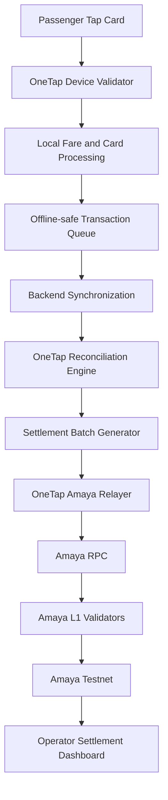
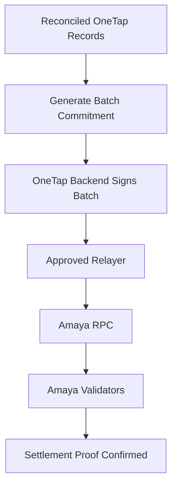
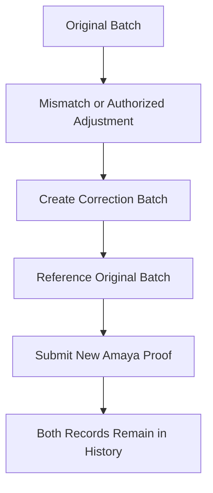

# Amaya L1 — OneTap Integration

## Overview

OneTap is planned as the first infrastructure-focused Proof of Concept connected to Amaya L1.

OneTap is a transport and parking payment prototype designed around:

- tap-card transactions
- fast local processing
- offline operation
- operator reconciliation
- shift settlement
- merchant top-ups
- transport and parking use cases

Amaya L1 will not replace OneTap's local transaction engine.

Instead, Amaya L1 is being explored as a settlement, reconciliation, and audit layer for completed OneTap activity.

## Important Terminology

OneTap currently uses the term **Validator App** for the application running on the transport or parking device.

This is different from an **Amaya L1 blockchain validator**.

### OneTap Validator App

The OneTap Validator App:

- reads the passenger card
- validates local card rules
- processes tap-in and tap-out
- calculates or applies the fare
- updates the local card balance
- queues transactions during weak connectivity

### Amaya L1 Validator

An Amaya L1 validator:

- participates in blockchain consensus
- verifies submitted settlement transactions
- confirms Amaya L1 blocks
- maintains the official blockchain state

To avoid confusion, public documentation may refer to the OneTap application as the:

> **OneTap Device Validator**

and the blockchain infrastructure as the:

> **Amaya L1 Validator**

## Integration Objective

The first integration should prove that OneTap can:

1. Continue processing taps locally.
2. Operate during temporary loss of internet connectivity.
3. Reconcile completed transactions with the backend.
4. Group transactions into a settlement batch.
5. Generate a cryptographic commitment for the batch.
6. Record that commitment on Amaya Testnet.
7. Verify that the backend batch matches the on-chain proof.
8. detect an altered, duplicate, or mismatched batch.

## Why Settlement Batching

The first design should not submit every passenger tap directly to the blockchain.

Direct submission would create unnecessary dependency on:

- continuous internet connectivity
- RPC availability
- blockchain confirmation time
- one transaction per tap
- continuous gas sponsorship

Instead:

```text
Passenger taps
→ OneTap processes locally
→ Transactions are queued
→ Backend reconciles transactions
→ Completed records are grouped
→ Settlement batch proof is recorded on Amaya
```

This preserves OneTap's speed and offline operation while adding an independent settlement record.

## Initial Architecture



## Initial Proof-of-Concept Scope

The first OneTap Proof of Concept should use:

```text
Network: Amaya Local Alpha
Blockchain validators: 1
OneTap environment: Development or synthetic test
Payments: Mock balances only
Native asset: TAMAYA
Passenger data: Synthetic
Public users: None
```

No real passenger money should be placed on the local Proof-of-Concept network.

## OneTap Transaction Lifecycle

### Stage 1 — Card Tap

The passenger taps the card on the OneTap device.

The device validates:

- card format
- card status
- available local balance
- tap sequence
- route or parking rules
- duplicate-tap protection
- applicable fare

### Stage 2 — Local Processing

The transaction is processed locally.

This may include:

- updating the stored card balance
- recording tap-in
- recording tap-out
- calculating distance or fixed fare
- recording device and operator references
- storing a local transaction identifier
- adding the transaction to the offline queue

Blockchain connectivity is not required for this step.

### Stage 3 — Backend Synchronization

When connectivity is available, the device sends queued transactions to the OneTap backend.

The backend verifies:

- transaction identifier
- device authorization
- operator assignment
- card reference
- timestamps
- fare calculation
- duplicate status
- transaction sequence
- previous synchronization state

### Stage 4 — Reconciliation

The backend compares:

```text
Device transaction
Card balance movement
Operator shift records
Route or parking records
Backend transaction state
```

Transactions may receive a status such as:

```text
PENDING
VALIDATED
RECONCILED
REJECTED
DUPLICATE
MISMATCH
SUPERSEDED
```

Only reconciled transactions should enter a finalized settlement batch.

### Stage 5 — Settlement Batch

A settlement batch groups completed transactions for a defined period.

Possible periods include:

- operator shift
- vehicle shift
- route day
- parking facility day
- merchant settlement period

The batch generator produces:

- batch identifier
- operator identifier or commitment
- covered time period
- transaction count
- total collected amount
- refund or adjustment total
- net settlement total
- cryptographic transaction-tree root or batch hash
- backend signing reference
- creation timestamp

### Stage 6 — Amaya Submission

The approved OneTap relayer submits the settlement proof to Amaya Testnet.



### Stage 7 — Verification

The dashboard compares the current OneTap settlement batch with the Amaya record.

Possible results:

```text
VERIFIED
The current settlement batch matches the Amaya proof.

PENDING
The batch has been created but is not yet confirmed.

MISMATCH
The current batch does not match the recorded proof.

DUPLICATE
The same batch identifier was previously recorded.

SUPERSEDED
An authorized correction references this batch.

NOT FOUND
No matching Amaya record exists.
```

## Initial On-Chain Record

The first settlement-proof contract may store:

```text
Batch identifier
Application identifier
Settlement-period reference
Transaction count
Gross-total commitment
Adjustment-total commitment
Net-total commitment
Batch hash or Merkle root
Source-system signer
Submission timestamp
Record status
Previous-batch reference where applicable
```

The exact public fields will be finalized during contract design.

## Data That Should Remain Off-Chain

The following should not be placed directly on Amaya L1:

- passenger name
- telephone number
- complete card identifier
- complete passenger travel history
- exact personal movement pattern
- operator personal information
- device private keys
- GCash or bank-account details
- raw backend credentials
- detailed anti-fraud rules

Where a card or operator reference is needed, use a privacy-preserving internal reference or cryptographic commitment.

## Settlement Proof Contract

A possible Proof-of-Concept contract may be called:

```text
OneTapSettlementProofRegistry
```

Possible functions may include:

```text
registerBatch
getBatch
verifyBatch
supersedeBatch
pauseSubmissions
authorizeRelayer
revokeRelayer
```

These names are conceptual and do not represent a deployed contract.

## Contract Requirements

The settlement registry should:

- reject duplicate batch identifiers
- accept submissions only from approved relayers
- preserve the original record
- allow corrections only through linked superseding records
- emit events for explorer and dashboard indexing
- support emergency submission pause
- avoid storing private passenger data
- use clear status transitions
- prevent unauthorized deletion

## Corrections and Adjustments

Blockchain records should not prevent lawful corrections.

They should prevent silent replacement.



Example:

```text
Original batch: OT-SHIFT-1001
Status: SUPERSEDED

Correction batch: OT-SHIFT-1001-C1
Reason: Authorized fare adjustment
Previous batch: OT-SHIFT-1001
Status: VERIFIED
```

## Idempotency

Submitting the same settlement request more than once must not create multiple independent settlement records.

The system should use:

- unique batch identifiers
- database uniqueness rules
- smart-contract duplicate checks
- deterministic reconciliation references
- retry-safe relayer logic

A temporary RPC failure should allow safe retry without duplicating the settlement.

## Relayer Design

The OneTap relayer submits approved settlement proofs and sponsors TAMAYA gas.

The relayer should have:

- a dedicated test wallet
- limited TAMAYA balance
- contract-method restrictions
- signed backend requests
- request-expiration checks
- replay protection
- batch-identifier validation
- rate limits
- daily submission limits
- monitoring and alerts
- emergency disable controls

The relayer must not control:

- validator management
- the Amaya test treasury
- Move+ relayer funds
- user wallets
- contract-upgrade governance

## Gas Sponsorship

The first OneTap integration may sponsor all TAMAYA gas.

```text
OneTap generates approved batch
→ OneTap relayer submits transaction
→ Relayer pays TAMAYA gas
→ Operator and passengers do not handle TAMAYA
```

This allows the OneTap user experience to remain familiar.

For a future commercial deployment, infrastructure and sponsored gas may be included in:

- a monthly operator service fee
- an annual infrastructure contract
- an agreed settlement package
- another approved business model

## Offline Operation

OneTap must continue operating when:

- the RPC is unavailable
- the internet connection is weak
- the Amaya Testnet is temporarily paused
- the backend cannot be reached immediately

During an outage:

```text
Taps continue locally
→ Transactions remain queued
→ Connectivity returns
→ Transactions synchronize
→ Backend reconciles
→ Settlement batch is submitted
```

The blockchain should strengthen settlement integrity without becoming a single point of failure for the physical tap experience.

## Failure Scenarios

### RPC Unavailable

```text
Local taps continue
Settlement submission remains pending
Relayer retries safely
```

### Amaya Validator Offline

```text
Local taps continue
Backend reconciliation continues
Batch waits for network recovery
```

### Backend Unavailable

```text
Device stores transactions locally
Queue remains protected
Synchronization resumes later
```

### Duplicate Batch Submission

```text
Contract or backend rejects duplicate identifier
Existing settlement record is returned
```

### Batch Mismatch

```text
Dashboard displays MISMATCH
Settlement is not silently changed
Authorized investigation or correction is required
```

### Relayer Compromised

```text
Relayer is disabled
Relayer wallet is rotated
Contract authorization is revoked
Logs and submissions are reviewed
```

## Operator Dashboard

The OneTap operator dashboard may show:

```text
Current shift
Transactions processed
Transactions synchronized
Transactions reconciled
Pending records
Rejected records
Gross collection
Adjustments
Net settlement
Amaya verification status
Batch transaction identifier
Last successful synchronization
```

The dashboard should not expose private validator infrastructure or keys.

## Public Verification

A limited public or partner verification page may later allow an authorized party to check:

- settlement batch identifier
- transaction count
- settlement period
- verification status
- Amaya transaction reference
- confirmation timestamp

Private passenger and operator information must remain hidden.

## Initial Demonstration

A public demonstration may use:

```text
Fake transport operator
Fake route
Fake passenger cards
Fake balances
Fake tap-in and tap-out records
Fake shift settlement
TAMAYA gas
Amaya Local Alpha or Testnet
```

It must clearly state:

> Prototype using synthetic data. No transport operator affiliation, live fare collection, or real passenger payment is represented.

## Proof-of-Concept Test Cases

The first OneTap integration should test:

1. Valid tap-in and tap-out.
2. Offline transaction queue.
3. Successful synchronization.
4. Settlement-batch creation.
5. Amaya proof submission.
6. Successful dashboard verification.
7. Duplicate batch rejection.
8. Intentional batch alteration.
9. Mismatch detection.
10. Authorized correction record.
11. RPC interruption and safe retry.
12. Validator shutdown and recovery.
13. Relayer balance monitoring.
14. No passenger data exposed on-chain.

## Success Criteria

The OneTap Proof of Concept is complete when:

- [ ] Taps remain fast and locally processed.
- [ ] Offline transactions remain recoverable.
- [ ] Reconciled transactions form a deterministic batch.
- [ ] The batch proof is confirmed on Amaya.
- [ ] The dashboard verifies a valid batch.
- [ ] An altered batch is detected.
- [ ] Duplicate submission does not create duplicate settlement.
- [ ] Corrections preserve the original record.
- [ ] RPC failure does not lose OneTap transactions.
- [ ] No real money is used.
- [ ] No passenger personal data is placed on-chain.
- [ ] The process is publicly documented and reproducible.

## Future Parking Integration

The same settlement model may later support parking:

```text
Vehicle enters
→ Parking session starts
→ Local system calculates fee
→ Payment is recorded
→ Daily settlement batch is generated
→ Proof is submitted to Amaya
```

Parking remains a future expansion after the initial transport settlement Proof of Concept is stable.

## Future Production Considerations

Before processing real payments, OneTap would require:

- operator agreement
- legal and regulatory review
- production security assessment
- payment-partner integration
- data-privacy review
- disaster-recovery testing
- production validator and RPC infrastructure
- audited smart contracts
- documented refund and dispute procedures
- clear operational responsibility

## Current Status

OneTap integration with Amaya L1 is currently in architecture planning.

No live transport fare, parking payment, operator settlement, or production OneTap smart contract is represented by this repository.
