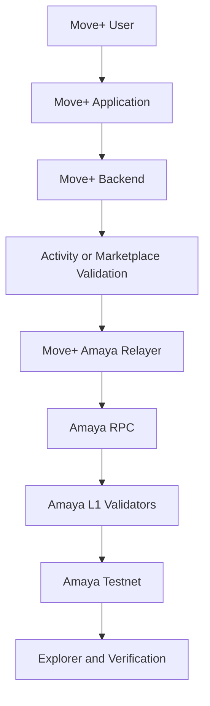
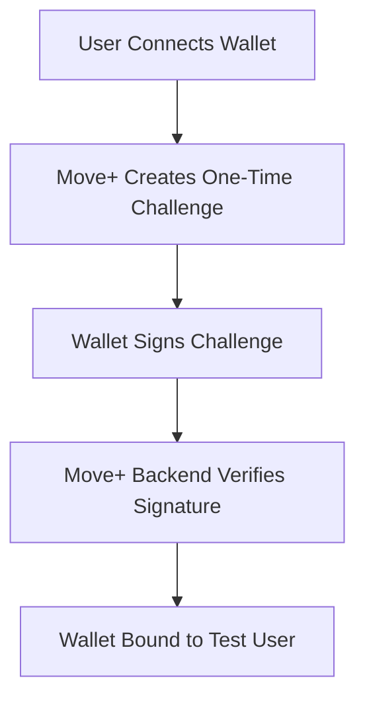
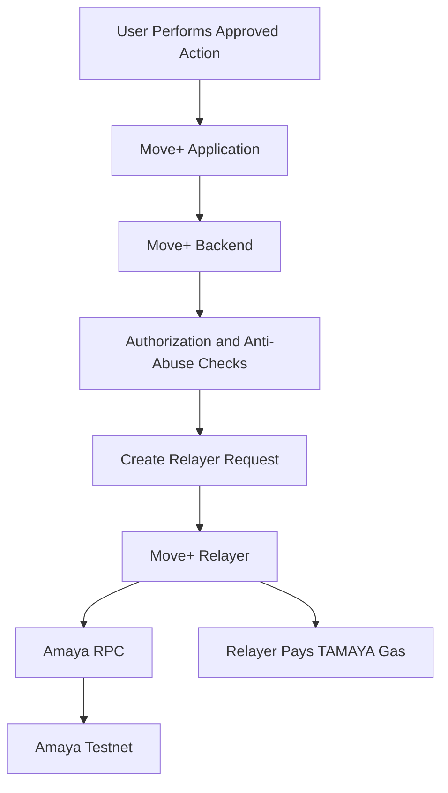
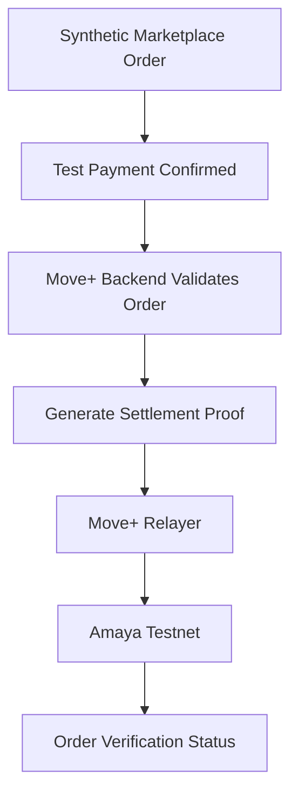

# Amaya L1 — Move+ Integration

## Overview

Move+ is planned as the first consumer-facing application integrated with Amaya L1.

Move+ is a gamified fitness ecosystem supporting:

- walking
- running
- cycling
- activity rewards
- digital gear
- challenges and achievements
- real-item marketplace features
- optional Web3 integrations

Amaya L1 will not replace Move+'s existing application backend or current blockchain integrations.

The initial Amaya integration will be additive and isolated so that existing Ronin, Base, Celo, MiniPay, and Web2 functionality remains unchanged.

## Integration Objective

The first integration should prove that Move+ can:

1. Connect to Amaya Testnet.
2. Read an Amaya wallet address and TAMAYA balance.
3. Verify wallet ownership.
4. Submit an approved test transaction.
5. Sponsor TAMAYA gas through a Move+ relayer.
6. Record a marketplace or reward-settlement proof.
7. Verify the transaction through an explorer or dashboard.
8. Continue operating normally when Amaya is unavailable.

## Integration Principles

The Move+ integration follows these principles:

- Amaya support is optional.
- Existing Move+ chains remain unchanged.
- Web2 users remain able to use Move+.
- Raw fitness and personal data remain off-chain.
- Move+ validates activity before any proof is submitted.
- The application may sponsor gas for approved actions.
- Testnet assets have no monetary value.
- No production AMAYA asset is required during testing.

## Existing Move+ Architecture

Move+ currently relies on application services for:

- user authentication
- activity tracking
- fitness validation
- anti-cheat checks
- marketplace orders
- user profiles
- messages
- reward calculations
- application history
- private user information

These systems remain authoritative for application-level decisions.

Amaya L1 may receive only the approved result or settlement proof.

## Proposed Testnet Architecture



## Initial Proof-of-Concept Scope

The first Move+ integration should use:

```text
Network: Amaya Local Alpha or Amaya Testnet
Native asset: TAMAYA
Wallets: Test wallets only
Users: Developers and approved testers
Payments: Synthetic or test-only
Production chains: Unchanged
Real customer funds: None
```

## Phase 1 — Read-Only Connection

The first Move+ development build should be able to:

- connect to the Amaya RPC
- confirm the correct chain ID
- display the connected wallet address
- display the TAMAYA balance
- read the current block height
- retrieve a test transaction receipt
- detect when the RPC is unavailable

No Move+ business logic should be changed during this phase.

## Phase 2 — Wallet Ownership Verification

Move+ may verify that a user controls an Amaya wallet through a signed message.



The challenge should include:

- user reference
- Amaya network name
- unique nonce
- issue timestamp
- expiration timestamp
- intended action

The same signature challenge must not be reusable.

## Phase 3 — Sponsored Test Transaction

Move+ may sponsor approved transactions so users do not need to manually obtain TAMAYA.



The user experience remains similar to a normal application action.

## Potential Initial On-Chain Functions

The first integration should use only one or two narrow functions.

Possible examples include:

- marketplace settlement proof
- reward-batch proof
- approved challenge-completion proof
- test digital-gear ownership
- creator-reward distribution proof
- application-sponsored TAMAYA transfer

The initial Proof of Concept should not attempt to place the entire Move+ economy on Amaya.

## Marketplace Settlement Proof

A test marketplace transaction may follow this flow:



A possible on-chain record may contain:

```text
Order reference hash
Payment-method category
Settlement amount commitment
Merchant reference
Buyer reference commitment
Settlement timestamp
Settlement status
Application signer
```

The following remain off-chain:

- buyer name
- delivery address
- telephone number
- complete product order
- payment credentials
- courier information
- private merchant information

## Reward-Batch Proof

Move+ may group approved rewards into a batch.

```text
Validated activities
→ Reward calculation
→ Duplicate and anti-cheat checks
→ Reward batch generated
→ Batch commitment recorded on Amaya
```

A reward-batch record may contain:

```text
Batch identifier
Application mode
Covered earning period
Number of approved reward records
Total reward commitment
Batch hash or Merkle root
Submission timestamp
Application signer
```

Individual raw GPS tracks and health information must not be included.

## Activity Data Boundaries

### Suitable for On-Chain Proofs

- approved activity-result reference
- anonymized challenge-completion proof
- reward-batch commitment
- digital-gear ownership
- marketplace settlement proof
- achievement identifier
- application signing address
- timestamp
- correction or revocation status

### Must Remain Off-Chain

- raw GPS coordinates
- complete route history
- heart-rate information
- health information
- user name and email
- home or delivery address
- private anti-cheat data
- device identifiers
- messages and uploaded media
- detailed account history

## Anti-Cheat Responsibility

Amaya validators do not determine whether a Move+ activity is legitimate.

The Move+ backend remains responsible for:

- GPS validation
- speed analysis
- distance validation
- duplicate detection
- suspicious-behavior checks
- user and device checks
- reward eligibility
- daily earning limits
- equipment and chain rules

Amaya receives only an approved result signed by the authorized Move+ system.

## Relayer Design

The Move+ relayer should use:

- a dedicated wallet
- limited TAMAYA balance
- approved contract methods only
- signed backend requests
- short request-expiration periods
- nonce and replay protection
- per-user transaction limits
- rate limiting
- daily gas limits
- monitoring and alerts
- emergency disable controls

The Move+ relayer must not control:

- validator management
- OneTap relayer funds
- the test treasury
- contract-upgrade governance
- user wallets

## Idempotency

Move+ transactions must be safe to retry.

The system should prevent duplication using:

- unique settlement identifiers
- unique reward-batch identifiers
- database uniqueness rules
- smart-contract duplicate checks
- deterministic request references
- transaction-status polling

An RPC timeout must not cause Move+ to create two separate settlement records.

## Amaya Network Failure

Move+ should remain usable if Amaya is temporarily unavailable.

```text
Amaya RPC unavailable
→ Move+ records the approved action internally
→ On-chain submission remains pending
→ Relayer retries safely when service returns
```

Amaya must not become a single point of failure for:

- activity tracking
- activity saving
- marketplace browsing
- Web2 user accounts
- existing Ronin functionality
- existing Base functionality
- MiniPay marketplace checkout

## Chain Separation

The first Amaya integration must remain isolated from existing chain implementations.

```text
Ronin
→ Existing Move+ NFT and ENR flow remains unchanged

Base
→ Existing Founder Gear and wallet flow remains unchanged

Celo and MiniPay
→ Existing marketplace payment flow remains unchanged

Amaya Testnet
→ New optional test integration only
```

Shared backend code must be chain-aware and reviewed before deployment.

## Test Wallet Experience

During developer testing, users may connect through an EVM-compatible wallet.

Possible test flow:

```text
Move+ development build
→ Select Amaya Testnet
→ Connect test wallet
→ Sign ownership challenge
→ Display TAMAYA
→ Submit sponsored test action
→ View transaction proof
```

Ordinary production users should not be required to understand validators, RPC endpoints, or gas.

## Proof-of-Concept Test Cases

The first Move+ integration should test:

1. Correct Amaya RPC connection.
2. Wrong chain detection.
3. Wallet ownership signature.
4. TAMAYA balance display.
5. Sponsored test transaction.
6. Relayer replay protection.
7. Duplicate-settlement rejection.
8. RPC interruption and retry.
9. Validator stop and restart.
10. Transaction verification after recovery.
11. No production-chain behavior changed.
12. No raw fitness data exposed on-chain.

## Success Criteria

The Move+ Proof of Concept is complete when:

- [ ] Move+ connects to the correct Amaya network.
- [ ] The correct chain ID is verified.
- [ ] Wallet ownership can be proven.
- [ ] TAMAYA balance can be displayed.
- [ ] One sponsored transaction confirms.
- [ ] One settlement or reward proof is recorded.
- [ ] Duplicate requests are rejected.
- [ ] RPC failure does not lose approved application data.
- [ ] Existing multichain functionality remains unchanged.
- [ ] No raw GPS, health, or personal information is placed on-chain.
- [ ] The complete process is publicly documented.

## Future Possibilities

Possible future Amaya integrations may include:

- Move+ marketplace settlement
- digital-gear ownership
- approved game assets
- challenge proofs
- creator rewards
- merchant settlement
- application-specific smart accounts
- sponsored network transactions

These remain future possibilities and are not production commitments.

## Current Status

Move+ integration with Amaya L1 is currently in architecture planning.

No production Move+ transaction, customer fund, NFT, activity reward, or marketplace purchase is currently processed through Amaya L1.
