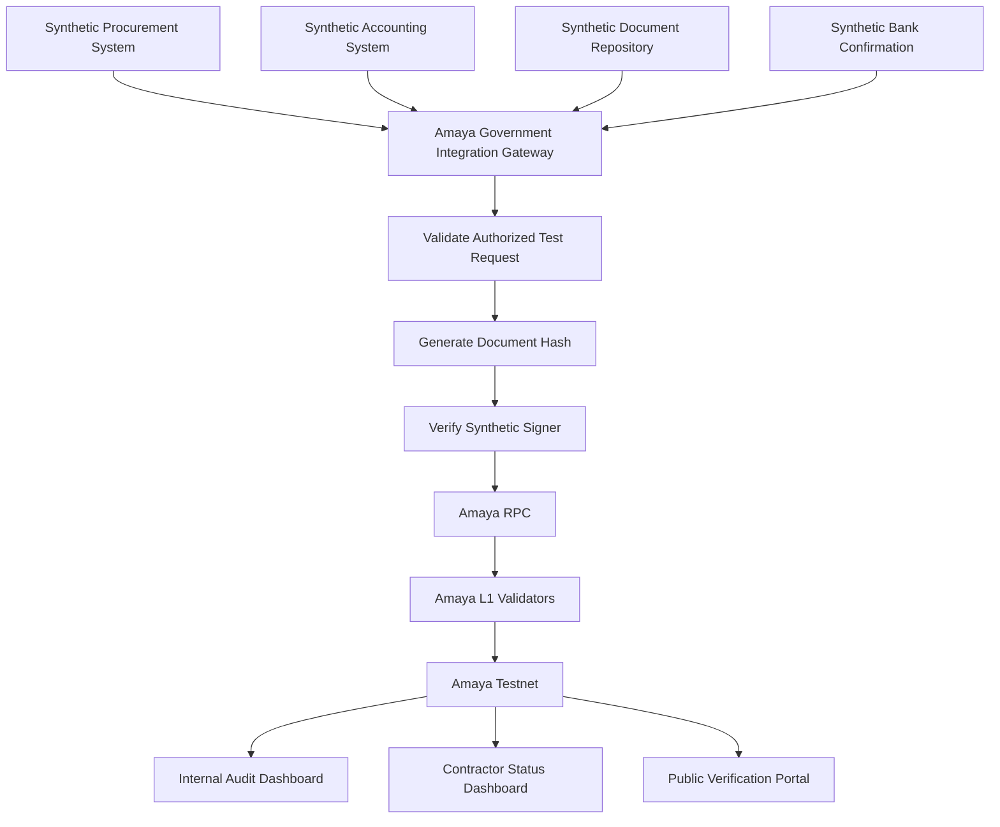
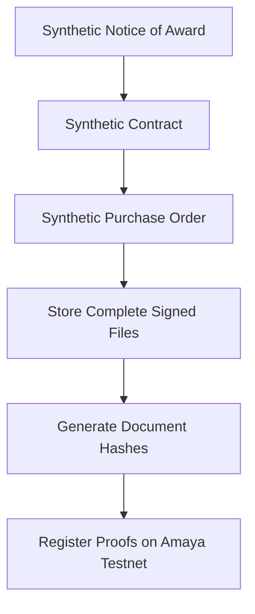
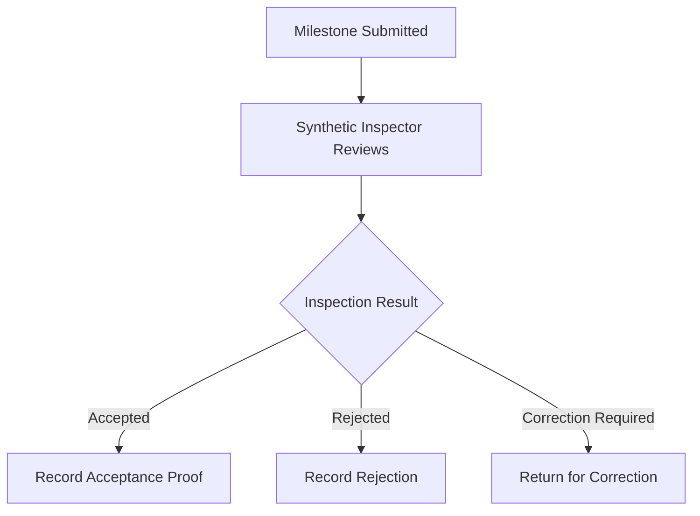
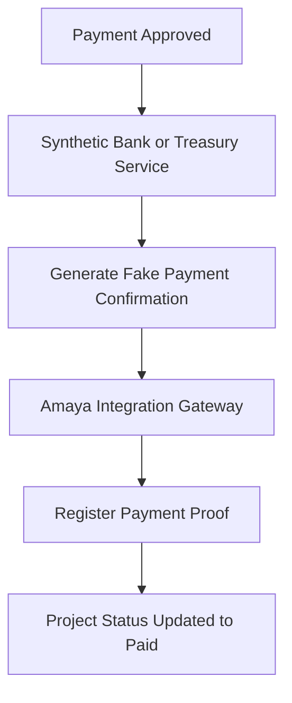
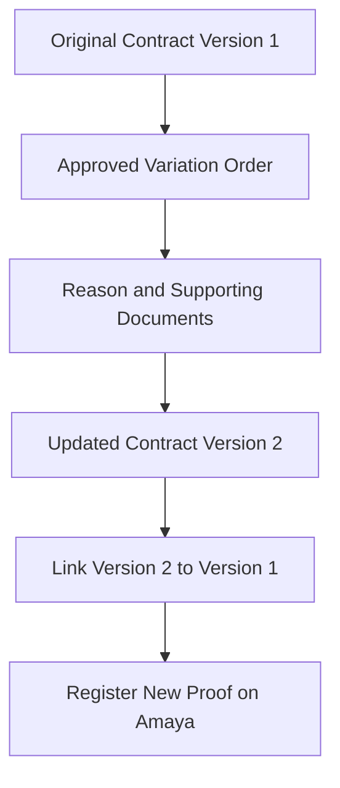

# Amaya L1 — Government Pilot Concept

## Status

This document describes a future synthetic demonstration concept.

No Philippine government agency, regional office, local government unit, contractor, supplier, bank, or public official is represented as a partner.

Any public demonstration must clearly state:

> **Prototype using synthetic data. No government affiliation, official record, real contractor, or public payment is represented.**

## Proposed Pilot Name

# Government Contractor Payment Integrity Pilot

## Initial Focus

The proposed first government-oriented demonstration focuses on:

> **Government-to-supplier and contractor payment integrity**

It does not initially focus on:

- citizen payments
- nationwide government deployment
- cryptocurrency payments to contractors
- direct release of government funds
- replacing government banking systems
- replacing existing procurement systems
- storing citizen personal data on-chain

## Why This Use Case

Government supplier and contractor payments involve a sequence of records and approvals, including:

- Notice of Award
- contract
- Purchase Order
- project schedule
- delivery or milestone records
- inspection reports
- acceptance documents
- billing statements
- variation orders
- accounting approvals
- payment references

A tamper-evident timeline may help prove that payment followed an authorized process.

## Core Principle

Amaya L1 should not initially release or hold government money.

The existing government accounting, treasury, and authorized banking systems continue processing Philippine-peso payments.

Amaya L1 records evidence connecting:

```text
Contract
→ Delivery or milestone
→ Inspection
→ Acceptance
→ Approval
→ Peso payment
→ Final reconciliation
```

## Demonstration Domain

The synthetic demonstration may later be hosted at:

```text
gov-pilot.amayal1.com
```

The domain must not imitate an official government website.

It should display a permanent disclaimer explaining that all agencies, officials, contractors, documents, and payments are fictional.

## Initial Demonstration Scope

```text
Agency: Fictional regional government office
Projects: 3 to 10 synthetic projects
Network: Amaya Testnet
Payments: Fake Philippine-peso confirmations
Documents: Synthetic
Contractors: Fictional
Duration represented: 3 to 6 months
Public funds: None
Government affiliation: None
```

## Synthetic Components

The demonstration may include:

- fake government office
- fake procurement team
- fake accounting team
- fake inspectors
- fake approving officials
- fake contractors
- fake contracts
- fake Purchase Orders
- fake inspection reports
- fake variation orders
- fake bank-payment confirmations
- synthetic document storage
- approval workflows
- public verification dashboard
- internal audit dashboard

## Proposed Architecture



## Demonstration Responsibilities

During the independent Amaya Testnet demonstration, Amaya builds the complete synthetic environment.

Amaya may build:

- mock procurement portal
- mock accounting workflow
- mock document repository
- mock bank-confirmation service
- Integration Gateway
- document hashing
- synthetic digital-signature workflow
- smart contracts
- internal dashboard
- contractor dashboard
- public verification portal
- audit timeline
- alteration-detection demonstration

## Official Pilot Responsibility

During any future authorized government pilot, the government remains responsible for:

- official procurement decisions
- legal approval workflows
- official documents
- employee roles
- public funds
- accounting decisions
- payment authorization
- government data classification
- official digital signatures
- acceptance of the system

Amaya would act only as an approved technology and infrastructure provider under the relevant agreement.

## Complete Documents and Hashes

A hash alone cannot display or restore a document.

The proposed architecture therefore uses:

```text
Complete signed document
→ Secure version-controlled repository
→ Cryptographic hash generated
→ Hash and metadata recorded on Amaya
→ Authorized users retrieve the document
→ System verifies that the document still matches
```

The document is the official content.

The digital signature identifies the authorized issuer.

The hash proves that the document has not been secretly altered.

Amaya L1 preserves the independent registration and status timeline.

## Why Complete Documents Usually Remain Off-Chain

Complete files should normally remain outside the blockchain because they may contain:

- personal information
- bank information
- confidential contract sections
- signatures
- technical plans
- large photographs
- lengthy inspection reports
- information requiring correction or restricted access

Writing complete confidential files permanently on-chain could create unnecessary privacy, storage, and security risks.

## Document Record

A document-proof record may contain:

```text
Project identifier
Document identifier
Document type
Document version
Document hash
Previous-version hash
Issuing office
Authorized signer reference
Registration timestamp
Approval status
Storage reference commitment
Public or restricted classification
Revoked or superseded status
```

The storage reference must not expose private repository credentials.

## Document Classifications

### Public

Possible examples:

- public Notice of Award
- public project summary
- public contract value
- public milestone status
- approved variation-order summary

The verification portal may display a redacted public copy.

### Restricted

Possible examples:

- detailed inspection report
- internal accounting record
- complete payment confirmation
- confidential contractor submission

Only authorized personnel may retrieve the complete document.

### Sensitive

Possible examples:

- bank-account information
- personal identification
- investigation records
- employee credentials
- confidential security details

Only the minimum non-identifying proof should be registered on-chain.

## Stage 1 — Contract Registration



Possible registered information includes:

- project identifier
- contractor reference
- contract-value commitment
- contract version
- issue timestamp
- document hashes
- authorized signer
- active status

## Stage 2 — Milestone or Delivery

The fictional contractor submits a delivery or project milestone.

Possible supporting files include:

- delivery receipt
- progress report
- photographs
- quantity report
- test result
- invoice
- billing statement

Complete files remain in the synthetic document repository.

Their hashes and submission statuses are recorded through the Integration Gateway.

## Stage 3 — Inspection and Acceptance



The blockchain does not decide whether the milestone is acceptable.

The authorized synthetic government role makes the decision, and Amaya records the resulting proof.

## Stage 4 — Payment Approval

A possible synthetic approval sequence is:

```text
Submitted
→ Inspected
→ Accepted
→ Accounting verified
→ Payment approved
→ Scheduled for release
```

The demonstration should enforce separation of roles.

One account should not be able to prepare, inspect, approve, release, and confirm the same payment alone.

## Stage 5 — Peso Payment Confirmation

The demonstration uses a fake Philippine-peso confirmation.



No cryptocurrency or real peso is released.

## Stage 6 — Reconciliation

The system compares:

```text
Contract
Approved milestone
Inspection result
Payment approval
Synthetic bank confirmation
Document versions
```

Possible results include:

```text
VERIFIED
PENDING
MISMATCH
DUPLICATE
SUPERSEDED
REVOKED
NOT FOUND
```

## Variation Orders

A variation order must not silently overwrite the original contract.



Example:

```text
Original value: ₱10,000,000
Approved variation: ₱500,000
New authorized value: ₱10,500,000

Original document: Stored and registered
Variation reason: Stored and registered
Approving authority: Synthetic and verified
Updated document: Stored and registered
Previous version: Preserved
```

## Corrections

Lawful corrections should be supported without deleting history.

```text
Original record remains
→ Correction record is created
→ Reason is documented
→ Authorized signer approves correction
→ New record references previous record
```

## Smart-Contract Modules

Possible Proof-of-Concept contracts include:

```text
ContractProofRegistry
MilestoneProofRegistry
InspectionProofRegistry
ApprovalTimelineRegistry
PaymentConfirmationRegistry
DocumentVersionRegistry
```

These names are conceptual and do not represent deployed production contracts.

## Integration Gateway

The Amaya Government Integration Gateway may:

- validate request format
- verify approved source systems
- verify signer authority
- generate document hashes
- remove prohibited fields
- create on-chain transaction payloads
- submit transactions through an approved relayer
- record transaction status
- support safe retry and idempotency
- log approved actions

The gateway must not independently approve a government contract, inspection, or payment.

## Internal Dashboard

The synthetic internal dashboard may display:

- project information
- contractor information
- complete document list
- document verification status
- milestone timeline
- inspection status
- approval timeline
- payment status
- mismatches
- correction history
- blockchain transaction references

## Contractor Dashboard

The fictional contractor dashboard may display:

- submission received
- inspection pending
- correction required
- milestone accepted
- accounting verification
- payment approved
- payment released
- payment proof verified

## Public Verification Portal

The public synthetic portal may display only:

- fictional project title
- fictional location
- contract value
- contractor name
- milestone percentage
- inspection status
- variation-order summary
- payment status
- blockchain verification status

Private credentials and restricted documents must remain hidden.

## Alteration Demonstration

The prototype should intentionally alter a stored document after registration.

```text
Original PDF
→ Hash registered on Amaya
→ File is modified
→ New hash is generated
→ Hash does not match
→ Portal displays ALTERED
```

This is one of the clearest demonstrations of the system's purpose.

## Missing Document Demonstration

The prototype should also test document loss.

Possible result:

```text
MISSING

An Amaya proof exists, but the corresponding stored document cannot be retrieved.
```

A blockchain hash cannot reconstruct a deleted document.

The document repository therefore requires:

- version history
- protected backups
- retention policies
- deletion logs
- access logs
- recovery testing

## Data That Must Not Be Publicly Exposed

- real government information
- real contractor bank details
- personal government IDs
- private employee information
- real signatures
- complete restricted contracts
- authentication credentials
- investigation records
- private infrastructure details
- repository access keys

## Proposed Regional Pilot Direction

A future authorized pilot should begin with:

```text
One regional office
One narrow contractor-payment category
Three to ten projects
Three to six months
Existing peso-payment process
No citizen wallet requirement
No AMAYA token requirement
Limited public dashboard
```

A regional pilot remains subject to official authorization, procurement, legal review, security assessment, and data-privacy requirements.

## Success Measurements

A future pilot could measure:

- document-verification time
- payment-reconciliation time
- duplicate-record detection
- mismatched-record detection
- audit-report preparation time
- number of missing approval steps
- system uptime
- transaction success rate
- recovery time after outage
- staff usability
- contractor-status visibility

## Proof-of-Concept Success Criteria

The synthetic government demonstration is complete when:

- [ ] Complete synthetic documents are stored securely.
- [ ] Document hashes are recorded on Amaya Testnet.
- [ ] Document versions are linked.
- [ ] Synthetic signer roles are separated.
- [ ] Milestone and inspection records are registered.
- [ ] Fake peso-payment confirmation is registered.
- [ ] Public and restricted fields are separated.
- [ ] Altered documents are detected.
- [ ] Missing documents are reported.
- [ ] Variation orders preserve previous history.
- [ ] Duplicate records are rejected.
- [ ] No government affiliation is implied.
- [ ] No real public data or funds are used.

## Current Status

The government pilot is a future synthetic research concept.

No official government pilot, contractor-payment system, government website, public document registry, or peso-payment integration is currently operated through Amaya L1.
