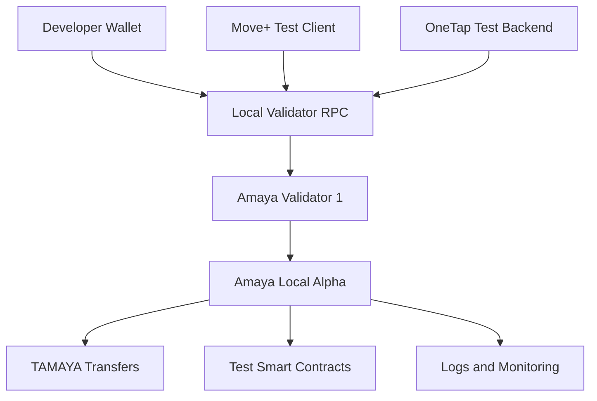
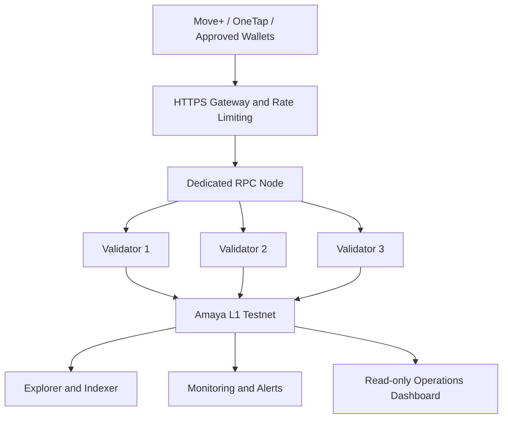
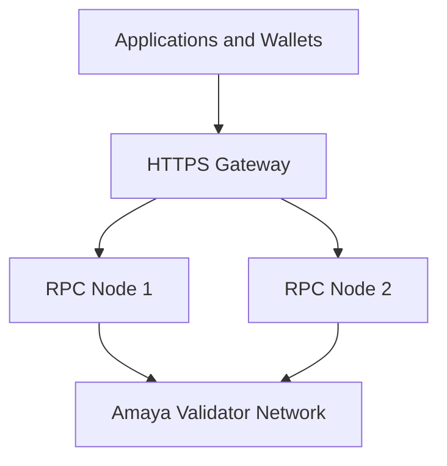
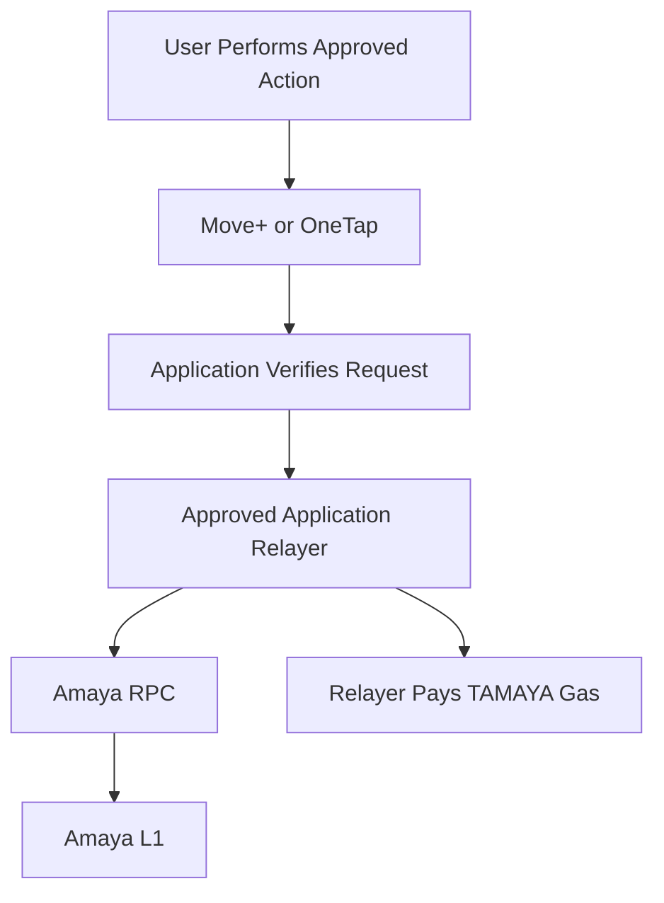
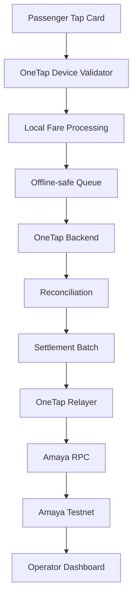
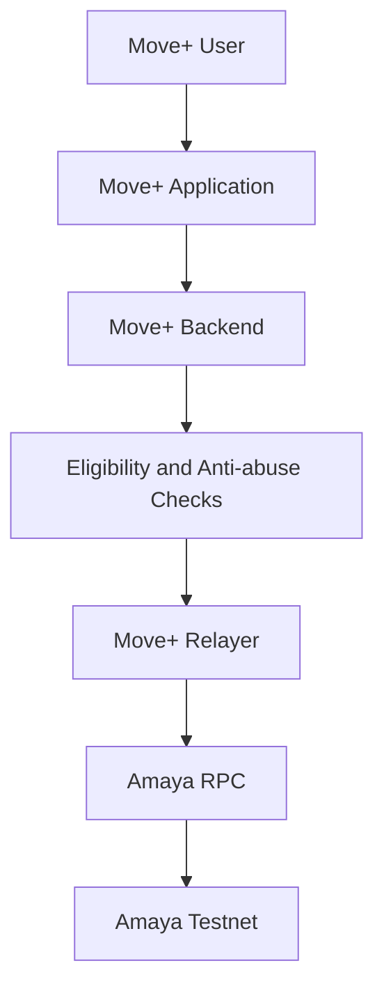

# Amaya L1 Technical Paper

## Infrastructure for a Moving World

**Version:** Draft v0.1  
**Status:** Research and Proof-of-Concept Design  
**Project:** Amaya L1  
**Initial applications:** Move+, Move+ Marketplace, and OneTap  
**Planned network model:** Permissioned Avalanche L1  
**Testnet native asset:** TAMAYA — no monetary value

> Amaya L1 is currently in research, documentation, and Proof-of-Concept development. This paper does not represent a public mainnet, token sale, government approval, financial-service licence, remittance partnership, lending partnership, or production deployment.

---

# 1. Abstract

Amaya L1 is a Philippine-focused research initiative exploring a permissioned Avalanche Layer 1 network for consumer applications, mobility infrastructure, marketplace settlement, payment reconciliation, and verifiable real-world records.

The project begins with two primary application directions:

- **Move+**, a gamified fitness ecosystem with activity tracking, digital gear, rewards, and marketplace functionality.
- **OneTap**, a transport and parking payment prototype designed for tap-card transactions, offline operation, operator reconciliation, and settlement.

Amaya L1 is not intended to replace application backends, regulated Philippine-peso payment systems, government databases, or private institutional systems.

Its proposed role is to provide an additional settlement and verification layer for approved applications and organizations.

The first technical milestone is a local Proof of Concept using:

- one validator
- one local RPC endpoint
- an EVM-compatible wallet
- the native TAMAYA test asset
- one confirmed TAMAYA transfer

Later phases may include:

- a three-validator Fuji testnet
- dedicated RPC infrastructure
- explorer and indexer services
- monitoring and alerts
- OneTap settlement batching
- Move+ integration
- approved external application access

---

# 2. Vision

Amaya L1 aims to become practical infrastructure connecting:

- movement and fitness
- digital ownership
- real-item marketplaces
- transportation and parking
- payment reconciliation
- document verification
- approved institutional applications

The project follows a product-first principle:

> Build practical applications, prove their infrastructure requirements, and introduce a dedicated network only where it creates measurable value.

Amaya L1 is not planned as:

- a meme-token network
- an unrestricted token-launch platform
- a general-purpose permissionless chain at launch
- a replacement for licensed banks
- a replacement for government financial systems
- a public database for personal information
- a system that forces ordinary users to manage blockchain gas

---

# 3. Initial Ecosystem Scope

## 3.1 Core Infrastructure

The proposed Amaya L1 infrastructure includes:

- Amaya L1
- Amaya Local Alpha
- Amaya L1 Testnet
- validator nodes
- RPC nodes
- explorer and indexer services
- monitoring and network-status services
- application relayers
- testnet documentation
- a possible future Amaya Wallet Testnet

## 3.2 Primary Applications

### Move+

Move+ is a gamified fitness application covering:

- walking
- running
- cycling
- activity rewards
- digital gear
- challenges
- achievements
- creator features
- marketplace functionality
- optional Web3 integrations

Possible Amaya L1 integrations include:

- wallet ownership verification
- sponsored transactions
- digital-gear ownership
- marketplace settlement proofs
- reward-batch commitments
- challenge-completion proofs
- approved application records

Raw GPS routes, health information, personal profiles, messages, and detailed anti-cheat records remain off-chain.

### Move+ Marketplace

Move+ Marketplace supports real-item and digital-utility commerce.

Possible Amaya L1 integrations include:

- merchant settlement proofs
- payment confirmation proofs
- buyer and seller transaction commitments
- reward distribution
- order-status verification
- approved marketplace smart contracts

The following remain off-chain:

- customer names
- delivery addresses
- telephone numbers
- payment credentials
- private merchant information
- courier and fulfilment information

### OneTap

OneTap is a transport and parking payment prototype designed around:

- tap-card transactions
- fast local processing
- offline-safe operation
- operator shift management
- merchant top-ups
- transaction reconciliation
- transport settlement
- parking settlement

OneTap is planned as the first infrastructure-focused Proof of Concept connected to Amaya L1.

---

# 4. Potential External Applications

Amaya L1 may later support approved external organizations such as:

- payment providers
- remittance companies
- lending companies
- financing companies
- transport operators
- parking operators
- cooperatives
- universities
- enterprises
- government-authorized systems

These are possible integrations and are not Amaya-owned applications.

Amaya may provide:

- settlement proofs
- reconciliation records
- payment confirmation proofs
- document integrity
- transaction audit trails
- approved smart-contract infrastructure

Each external organization remains responsible for:

- its own licences
- customer funds
- KYC and AML requirements
- credit decisions
- lending terms
- consumer protection
- regulatory compliance
- private customer data
- lawful business operations

Testnet access does not authorize an organization to operate a regulated financial service.

---

# 5. Why an Avalanche L1

Avalanche L1s allow a project to operate a network with its own:

- validator set
- native asset
- transaction history
- fee configuration
- contract-deployment rules
- access controls
- network governance
- application policies

Amaya is researching this model because it may provide:

- controlled validator membership
- controlled smart-contract deployment
- configurable transaction fees
- dedicated application capacity
- EVM-compatible development
- sponsored-gas transactions
- application-specific security controls
- future Avalanche interchain connectivity
- predictable infrastructure for approved applications

Amaya L1 does not automatically inherit the complete security of Avalanche C-Chain.

Amaya validators remain responsible for:

- consensus
- network availability
- validator operations
- software upgrades
- key security
- monitoring
- recovery
- governance

This provides greater control but also greater responsibility.

---

# 6. Network Model

## 6.1 Permissioned Proof of Authority

The planned early network model is permissioned Proof of Authority.

Approved validators participate in consensus.

Validator membership and critical network actions remain controlled through approved governance procedures.

Potential advantages include:

- known validator operators
- controlled infrastructure
- predictable network governance
- staged security testing
- restricted contract deployment
- institutional onboarding controls

Amaya L1 does not need to become a public permissionless chain during its early stages.

The network may eventually provide:

- public read access
- public explorer access
- selected public RPC access
- approved application access

while retaining control over:

- validators
- contract deployers
- relayers
- critical network configuration

## 6.2 Important Terms

### Proof of Concept

A working prototype proving that the proposed system can function.

### Proof of Authority

A validator model where approved operators are authorized to participate in consensus.

### Proof of Work

A mining-based consensus model.

Amaya L1 is not planned as a Proof-of-Work network.

> Amaya Local Alpha is a Proof of Concept using a Proof-of-Authority design.

---

# 7. Local Proof-of-Concept Architecture



Amaya Local Alpha uses:

- one local validator
- the validator's local RPC
- test-only wallets
- TAMAYA with no monetary value
- no public access
- no real customer funds
- no production application data
- no public bridge
- no production AMAYA asset

The local validator may be stopped when testing is not active.

When the validator is offline, the local network stops producing blocks.

---

# 8. Planned Fuji Testnet Architecture



A later stage may add:

- a second RPC node
- a load balancer
- additional validators
- separate hosting providers
- external uptime monitoring
- a public status page
- a branded explorer

---

# 9. Validators

A validator is a secured blockchain node that:

- checks transactions
- participates in consensus
- verifies proposed blocks
- confirms network state
- maintains a synchronized copy of Amaya L1
- verifies smart-contract execution
- helps prevent one application database from controlling the official record

Validators do not decide business questions such as:

- whether a Move+ activity is genuine
- whether a OneTap fare is correct
- whether a government contractor completed a milestone
- whether a lending applicant qualifies
- whether a remittance customer passed KYC

Those decisions remain with the authorized application or institution.

The validator confirms only the properly authorized blockchain transaction produced by that application or institution.

## 9.1 Validator Development Stages

### Local Alpha

```text
Validators: 1
Location: Local development machine
Public access: Disabled
RPC: Validator built-in RPC
Assets: TAMAYA only
Purpose: Education and Proof of Concept
```

### Fuji Testnet Alpha

```text
Validators: 1
Location: Persistent test environment
Public access: Limited
RPC: HTTPS endpoint
Assets: TAMAYA only
Purpose: External testing
```

### Public Testnet

```text
Validators: 3
RPC nodes: At least 1 dedicated node
Explorer: Enabled
Monitoring: Enabled
Applications: Move+ and OneTap demonstrations
Assets: TAMAYA only
```

### Possible Mainnet Readiness Target

```text
Validators: 5 or more
RPC nodes: 2 or more
Load balancer: Required
Multisig governance: Required
Independent security review: Required
Incident response: Required
Disaster recovery: Required
```

This is a planning target and not a commitment to launch.

---

# 10. RPC Infrastructure

RPC means Remote Procedure Call.

RPC infrastructure allows wallets and applications to:

- read wallet balances
- read blocks
- read transaction information
- estimate gas
- call smart-contract functions
- submit signed transactions
- retrieve transaction receipts

RPC nodes do not replace validators and do not decide consensus.

## 10.1 RPC Separation

The first local test may use the validator's built-in RPC.

Public application traffic should later use dedicated RPC infrastructure.



A mature RPC service should include:

- HTTPS
- TLS certificates
- rate limiting
- request-size limits
- connection limits
- health monitoring
- latency monitoring
- log rotation
- denial-of-service protection
- restricted administrative APIs
- restricted internal monitoring access

## 10.2 Possible Testnet Domains

```text
rpc-testnet.amayal1.com
explorer-testnet.amayal1.com
status.amayal1.com
docs.amayal1.com
```

These endpoints remain placeholders until the corresponding infrastructure is deployed and verified.

---

# 11. TAMAYA Testnet Asset

TAMAYA is the planned native asset of Amaya Testnet.

```text
Asset name: Test Amaya
Symbol: TAMAYA
Network: Amaya L1 Testnet
Value: None
Purpose: Testing and gas
```

TAMAYA may be used for:

- transaction gas
- wallet transfers
- test smart-contract deployment
- test contract calls
- application-relayer funding
- Move+ testing
- OneTap testing

TAMAYA is not:

- an investment
- a production token
- intended for sale
- intended for exchange listing
- a guarantee of receiving future AMAYA
- a representation of company ownership

Testnet balances may be reset, replaced, or deleted.

---

# 12. Future AMAYA Asset

Any future production AMAYA asset requires a separate design and review process.

This may include:

- canonical token chain
- fixed or controlled supply
- token utility
- allocation
- vesting
- treasury controls
- contract audit
- liquidity policy
- regulatory assessment
- relationship to Amaya L1 gas
- bridge or migration architecture
- public disclosures

The Amaya Testnet does not depend on a public AMAYA launch.

TAMAYA and AMAYA must remain separate.

| Asset | Network | Monetary Value | Purpose |
|---|---|---:|---|
| TAMAYA | Amaya Testnet | None | Testing and gas |
| AMAYA | Future production design | Not determined | Possible ecosystem and network utility |

---

# 13. Wallet Architecture

The first Amaya test will use an existing EVM-compatible wallet that supports custom network settings.

A wallet normally requires:

- network name
- RPC URL
- chain ID
- native currency symbol
- explorer URL

Separate test wallet accounts should be created for:

- network administration
- contract deployment
- test treasury
- Move+ relayer
- OneTap relayer
- normal test users

## 13.1 Future Amaya Wallet

A future Amaya Wallet Testnet may provide:

- Amaya Testnet preconfigured
- TAMAYA balance
- send and receive
- transaction history
- QR address display
- explorer links
- approved application connections
- permanent testnet warning

The intended early wallet model is non-custodial.

This means:

- private keys remain controlled by the user
- Amaya does not secretly control user funds
- transactions require user authorization
- private keys are not stored on Amaya servers

The first wallet version should not include:

- fiat balances
- cash-in or cash-out
- swaps
- public bridges
- yield products
- lending
- remittance
- token sales
- custodial recovery

---

# 14. Gas and Sponsored Transactions

Amaya L1 may configure low but nonzero transaction fees.

A nonzero fee helps protect against:

- spam
- denial-of-service attempts
- unrestricted contract execution
- unnecessary storage growth
- automated transaction flooding

Ordinary Move+ and OneTap users should not need to obtain TAMAYA manually.



Relayers should use:

- limited balances
- approved contract methods
- per-transaction limits
- daily spending limits
- request authentication
- request-expiration checks
- nonce and replay protection
- monitoring
- emergency disable controls

Move+ and OneTap must use separate relayer wallets.

---

# 15. OneTap Settlement Architecture

OneTap should not submit every passenger tap directly to the blockchain.

The preferred first design uses settlement batching.



A settlement batch may contain:

- batch identifier
- settlement period
- transaction count
- gross-total commitment
- adjustment-total commitment
- net-total commitment
- batch hash or Merkle root
- source-system signer
- timestamp
- status
- superseding-record reference

The following remain off-chain:

- passenger names
- telephone numbers
- complete card identifiers
- full travel histories
- operator bank details
- raw device credentials
- detailed fraud-prevention rules

## 15.1 Offline Operation

OneTap must continue processing taps when:

- internet connectivity is weak
- RPC is unavailable
- the Amaya network is paused
- the backend is temporarily unavailable

```text
Taps continue locally
→ Records remain queued
→ Connectivity returns
→ Transactions synchronize
→ Backend reconciles
→ Settlement batch is submitted
```

Blockchain settlement strengthens the audit trail without becoming a point of failure for the physical tap experience.

---

# 16. Move+ Integration Architecture

Move+ integration must remain additive.

Existing Ronin, Base, Celo, MiniPay, and Web2 functionality must remain unchanged unless a separate reviewed migration is approved.

The first Amaya integration may demonstrate:

- Amaya network connection
- wallet ownership verification
- TAMAYA balance display
- one sponsored transaction
- one settlement or reward-batch proof



Move+ remains responsible for:

- activity validation
- anti-cheat checks
- earning limits
- equipment rules
- marketplace orders
- reward calculation
- user accounts
- private user records

Amaya receives only the approved result or cryptographic commitment.

## 16.1 Data Boundaries

### Suitable for On-Chain Proofs

- approved activity reference
- reward-batch commitment
- marketplace settlement proof
- digital-gear ownership
- challenge-completion proof
- application signer
- timestamp
- correction status

### Remains Off-Chain

- raw GPS coordinates
- complete routes
- health information
- email addresses
- home addresses
- device identifiers
- detailed anti-cheat records
- messages
- uploaded media

---

# 17. Approved Application Onboarding

Amaya L1 is planned as a permissioned, application-focused network.

Anonymous applicants should not automatically receive production contract-deployment or institutional access.

## 17.1 Independent Testnet Developers

A registered Philippine business may not be required for:

- educational projects
- non-commercial experiments
- wallet testing
- test smart contracts
- open-source proofs of concept

Possible requirements include:

- verified identity
- email address
- GitHub profile
- project description
- intended testnet use
- agreement not to use real funds
- agreement not to place personal information on-chain

## 17.2 Commercial and Production Applicants

Production applicants may be required to provide:

- SEC or DTI registration
- BIR registration
- current business permit
- business address
- authorized representative
- ownership and management information
- technical architecture
- key-management plan
- privacy controls
- security contacts
- incident-response plan
- applicable licences
- smart-contract source code
- independent audit where required

## 17.3 Financial and Regulated Applicants

Organizations proposing:

- remittance
- payment operation
- fiat-to-crypto conversion
- crypto-to-fiat conversion
- custody
- exchange
- lending
- financing
- customer-fund handling

must provide evidence of applicable licences, approvals, or regulated partnerships.

Amaya Testnet approval does not replace regulatory authorization.

---

# 18. Government Pilot Research

A future synthetic demonstration may explore government-to-supplier and contractor payment integrity.

The proposed flow is:

```text
Contract awarded
→ Complete signed documents stored
→ Document hashes registered
→ Milestone submitted
→ Inspection recorded
→ Acceptance recorded
→ Authorized approval recorded
→ Existing peso-payment system releases funds
→ Payment confirmation proof registered
```

Amaya would not initially hold or release government money.

Complete documents remain in:

- secure storage
- version-controlled repositories
- protected backups

Amaya may record:

- document hashes
- document versions
- authority references
- timestamps
- approval status
- payment-proof commitments
- correction or superseding records

The demonstration may be hosted at:

```text
gov-pilot.amayal1.com
```

It must display:

> Prototype using synthetic data. No government affiliation, official record, real contractor, or public payment is represented.

---

# 19. Document Integrity Model

A hash alone cannot display or restore a document.

The correct structure is:

```text
Complete signed document
→ Secure document storage
→ Cryptographic hash generated
→ Hash and metadata recorded on Amaya
→ Authorized copy retrieved
→ Copy verified against on-chain hash
```

The document provides the official content.

The digital signature identifies the authorized issuer.

The hash proves whether the document changed.

Amaya L1 preserves the independent registration and status timeline.

## 19.1 Document Statuses

A verification portal may return:

```text
VALID
ALTERED
MISSING
REVOKED
SUPERSEDED
EXPIRED
NOT FOUND
```

A hash cannot reconstruct a deleted document.

The document-storage system therefore requires:

- version history
- retention rules
- backups
- deletion logs
- access logs
- disaster recovery
- recovery testing

---

# 20. Data Privacy

Amaya L1 should follow a minimum-data approach.

## Suitable On-Chain Data

- wallet addresses
- asset ownership
- transaction proofs
- settlement-batch identifiers
- document hashes
- version references
- timestamps
- approval statuses
- smart-contract events

## Data That Must Remain Off-Chain

- names and home addresses
- raw GPS routes
- health information
- passenger travel histories
- government identification information
- bank-account information
- complete confidential documents
- passwords
- private keys
- application credentials
- detailed anti-fraud logic

Encryption does not automatically make permanent on-chain personal data safe.

Private information should remain in systems where access, correction, retention, and deletion can be properly managed.

---

# 21. Security Model

The primary security principle is:

> One compromised device, server, account, application, or key must not control the entire Amaya network.

Critical roles must remain separated:

- validator identity
- validator management
- contract deployment
- network governance
- test treasury
- production treasury
- Move+ relayer
- OneTap relayer
- monitoring
- cloud administration

Planned controls include:

- testnet and mainnet key separation
- validator isolation
- dedicated RPC infrastructure
- SSH key authentication
- default-deny firewalls
- restricted administrative APIs
- encrypted backups
- monitoring and alerts
- staged software updates
- multisignature governance
- independent security reviews
- incident-response procedures
- disaster-recovery procedures

A public bridge is not planned for the first testnet or early controlled mainnet phase.

---

# 22. Validator Key Security

Sensitive validator files may include:

```text
staker.key
staker.crt
signer.key
```

These files must never be:

- committed to GitHub
- sent through email
- shared through messaging applications
- included in screenshots
- stored in public cloud folders
- copied into public server images
- reused between testnet and mainnet
- exposed through RPC

Backups should be:

- encrypted
- stored separately
- access-controlled
- tested through recovery exercises
- documented without exposing secrets

---

# 23. Governance

Early Amaya governance is expected to remain controlled and permissioned.

Critical authority may include:

- validator management
- treasury management
- contract upgrades
- fee configuration
- emergency response
- relayer authorization

Production governance should not depend on:

- one browser wallet
- one daily-use computer
- one private key
- one cloud account
- one employee

Possible controls include:

- hardware wallets
- multisignature approval
- dedicated administration devices
- transaction verification
- signer-replacement procedures
- recovery planning
- audit records

The final governance structure will be published only after testnet experience and security review.

---

# 24. Monitoring and Operations

Monitoring should track:

## Validator Health

- online or offline status
- synchronization status
- block height
- peer count
- CPU usage
- memory usage
- storage usage
- disk errors
- software version
- unexpected restarts

## RPC Health

- endpoint availability
- response latency
- request volume
- error rate
- rate-limit events
- TLS certificate expiration
- abnormal traffic

## Application Health

- relayer balance
- failed submissions
- pending transactions
- duplicate requests
- retry status
- application-specific errors

The first Amaya operations dashboard should be read-only.

It should not contain public buttons for:

- exporting keys
- transferring treasury assets
- removing validators
- changing governance
- deploying production contracts
- restarting every validator

---

# 25. Incident Response

The incident-response lifecycle is:

```text
Detect
→ Classify
→ Contain
→ Preserve evidence
→ Recover
→ Rotate credentials
→ Verify network state
→ Document incident
→ Improve controls
```

Possible incidents include:

- validator compromise
- relayer compromise
- RPC denial-of-service attack
- leaked credentials
- unauthorized contract deployment
- abnormal treasury transaction
- application-data breach
- lost administrator device
- corrupted database
- failed software upgrade

Recovery procedures must be tested on testnet before mainnet readiness is considered.

---

# 26. Development Roadmap

## Phase 0 — Documentation

- public GitHub repository
- technical architecture
- security model
- legal and project-status disclosures
- documentation website
- technical paper

## Phase 1 — Local Alpha

- one local validator
- local RPC
- wallet connection
- TAMAYA transfer
- validator stop and restart
- reproducible documentation

## Phase 2 — OneTap Proof of Concept

- synthetic tap transactions
- offline-safe queue
- backend reconciliation
- settlement batching
- Amaya proof submission
- mismatch detection
- duplicate rejection

## Phase 3 — Move+ Proof of Concept

- wallet connection
- signature verification
- sponsored transaction
- marketplace or reward proof
- no impact on existing chains

## Phase 4 — Fuji Alpha

- one persistent validator
- HTTPS RPC
- explorer access
- monitoring
- external wallet testing

## Phase 5 — Public Testnet

- three isolated validators
- dedicated RPC
- explorer and indexer
- public status page
- validator replacement exercise
- Move+ demonstration
- OneTap demonstration

## Phase 6 — External Application Sandbox

- testnet application process
- business-verification process
- approved contract deployment
- restricted relayer access
- testnet usage limits
- security review

## Phase 7 — Mainnet Readiness

- registered legal entity
- legal and regulatory review
- production funding
- multisignature governance
- independent smart-contract audit
- validator security assessment
- incident-response test
- disaster-recovery test
- explicit mainnet go or no-go decision

## Phase 8 — Controlled Mainnet

Mainnet will be considered only when:

- applications demonstrate genuine demand
- validator operations are stable
- infrastructure costs are sustainable
- security reviews are complete
- governance is documented
- production partners are identified
- legal requirements are addressed
- recovery procedures are tested

---

# 27. Evaluation Metrics

## Network Metrics

- block production stability
- transaction confirmation time
- transaction success rate
- RPC latency
- RPC error rate
- validator uptime
- recovery time
- storage growth
- monthly infrastructure cost

## OneTap Metrics

- offline queue reliability
- synchronization success
- settlement-batch generation time
- duplicate detection
- mismatch detection
- safe retry
- reconciliation time

## Move+ Metrics

- wallet-connection success
- signature-verification success
- sponsored-transaction success
- duplicate-proof rejection
- application availability during RPC failure

## Security Metrics

- validator replacement time
- backup recovery result
- alert detection time
- incident containment time
- credential-rotation time
- unresolved security findings

---

# 28. Risks and Limitations

Amaya L1 introduces risks including:

- validator concentration
- infrastructure outages
- private-key compromise
- RPC denial-of-service attacks
- smart-contract vulnerabilities
- insufficient application demand
- unsustainable operational costs
- regulatory uncertainty
- bridge risk
- privacy mistakes
- dependence on a small team
- misleading public expectations
- external application misconduct

A dedicated L1 is not justified merely because it can be created.

Mainnet should proceed only when testnet evidence shows that Amaya applications genuinely benefit from dedicated infrastructure.

---

# 29. Current Status

At Draft v0.1, Amaya L1 is in:

- public documentation
- architecture design
- security planning
- local Proof-of-Concept preparation

The following do not currently exist as production services:

- Amaya L1 mainnet
- public production RPC
- official Amaya explorer
- official Amaya Wallet
- production AMAYA asset
- live OneTap settlement on Amaya
- live Move+ settlement on Amaya
- government deployment
- remittance deployment
- lending deployment
- public bridge

---

# 30. Conclusion

Amaya L1 is being developed as a long-term infrastructure initiative grounded in practical application requirements.

Move+ provides the consumer and marketplace direction.

OneTap provides the mobility and settlement direction.

Approved external organizations may later use Amaya for:

- payment reconciliation
- remittance settlement proofs
- lending record proofs
- document integrity
- institutional audit trails

The project will begin with:

- documentation
- one local validator
- a working RPC connection
- wallet integration
- a TAMAYA transfer
- OneTap settlement testing
- Move+ integration

It will advance only through tested and documented milestones.

> **Product first. Network second. Mainnet only after proof.**

---

# References

1. Avalanche L1 documentation  
   https://build.avax.network/docs/avalanche-l1s

2. Create an Avalanche L1  
   https://build.avax.network/docs/tooling/avalanche-cli/create-avalanche-l1

3. Deploy an Avalanche L1 locally  
   https://build.avax.network/docs/tooling/avalanche-cli/create-deploy-avalanche-l1s/deploy-locally

4. Deploy an Avalanche L1 on Fuji Testnet  
   https://build.avax.network/docs/tooling/avalanche-cli/create-deploy-avalanche-l1s/deploy-on-fuji-testnet

5. Avalanche Validator Manager contracts  
   https://build.avax.network/docs/avalanche-l1s/validator-manager/contract

6. Avalanche blockchain permissioning  
   https://build.avax.network/academy/avalanche-l1/permissioned-l1s/02-proof-of-authority/01-blockchain-permissioning

7. Avalanche L1 transaction fees  
   https://build.avax.network/academy/avalanche-l1/l1-native-tokenomics/05-fee-config/02-transaction-fees

8. Avalanche Fee Manager  
   https://build.avax.network/docs/avalanche-l1s/precompiles/fee-manager

9. Avalanche Reward Manager  
   https://build.avax.network/docs/avalanche-l1s/precompiles/reward-manager

10. Avalanche node backup and restore  
    https://build.avax.network/docs/nodes/maintain/backup-restore

---

# Revision History

| Version | Status | Summary |
|---|---|---|
| v0.1 | Draft | Initial architecture, application scope, validator and RPC model, testnet plan, security principles, and external integration framework |
